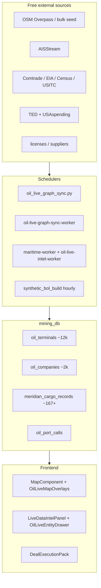

# Live Data: Unified Map + Deal Execution Pack

**Status:** Phases **0–10 complete** (2026-05-21). Live Data is production-ready for demo/ops with honest synthetic cargo labeling.

---

## Implementation status (2026-05)

| Area | Status | Key files / endpoints |
|------|--------|----------------------|
| **Meridian commercial graph** | Done | `008_commercial_graph.sql`, `oil_commercial_events`, `oil_live_graph_sync.py`, `POST /api/admin/oil-live/graph-sync` |
| **Graph-sync worker** | Done | `oil_live_graph_sync_worker.py`, `docker compose up -d oil-live-graph-sync-worker` |
| **Synthetic BOL / MCR** | Done | `009_meridian_cargo_records.sql`, `syntheticbol/engine.go` recipes **A–F**, `POST /internal/synthetic-bol-rebuild` |
| **OSM bulk seed + scale** | Done | `oil_terminals_seed_bulk.json` (297+ curated fallback; 33k OSM entities offline); graph-sync cap `OIL_GRAPH_STORAGE_IMPORT_CAP` default **15k** → **~12k** terminals in DB after dedup |
| **Census API** | Done | `backend/services/census_trade.py` — `CENSUS_API_KEY`, macro HS27 on graph-sync |
| **USITC DataWeb** | Done | `backend/services/usitc_dataweb.py` — `USITC_DATAWEB_API_KEY`, full client (not stub) |
| **Unified map** | Done | `App.tsx` keeps `MapComponent` for `live_data`; `OilLiveMapOverlays.tsx` |
| **Bbox + clustering** | Done | `GET /api/oil-live/map?bbox=`; `MarkerClusterGroup`; 450ms debounce + `keepPreviousData` |
| **Live Data UI polish** | Done | Larger readable fonts in intel drawer; **Gulf hub fly-to** (`liveDataMapDefaults.ts`); **`LiveDataMapLayersPanel`**; maritime canvas **off by default** on Live Data tab (no 22k AIS prefetch) |
| **Vessels API NULL draft** | Done | `queries.go` `listLiveVessels` — `draft_m` only when non-NULL |
| **Opportunity dedup** | Done | `dedupeOpportunities.ts` + `opportunity/dedup.go` server-side diversify |
| **Cargo drawer** | Done | `OilLiveEntityDrawer.tsx` — MCR tab, evidence, provenance, save shipper/consignee |
| **Deal Execution Pack** | Done | `DealExecutionPack.tsx`, `GET /opportunities/{id}/deal-pack`, economics inline |
| **Trader workflows** | Done | `liveDataWorkflow.ts` — Save to Suppliers, watch → `oil_watchlists`, CSV export (cargo + opportunities) |
| **Phase 9 — Alerts** | Done | Alerts tab in `LiveDataIntelPanel.tsx`; `oil_alerts`, mark-read, watchlists |
| **Phase 10 — Route planner** | Done | Deal pack **Route planner** button; `oil_live_logistics_hint` MCP + `logistics-hints` API |
| **MCP tools** | Done | `oil-live-intel/cmd/mcp`, 8 tools — map snapshot, explain event, contacts, save-to-suppliers, draft outreach |
| **sync-status** | Done | `GET /api/oil-live/sync-status` + health banner counts |
| **LIVE_DATA.md** | Done | `docs/LIVE_DATA.md` — onboarding, env keys, troubleshooting, trader workflows |
| **LICENSE_BULK_IMPORT cross-link** | Done | Bulk import docs referenced from `LIVE_DATA.md` trader section + `BulkImportLicensesModal`; suppliers feed graph via licenses |

---

## Metrics achieved (post graph-sync)

Typical counts after a successful `POST /api/admin/oil-live/graph-sync` (verify with `curl …/sync-status`):

| Metric | Achieved (typical) | Notes |
|--------|-------------------|-------|
| **Terminals** | **~12,000** | OSM import + bulk seed fallback; not 6 demo hubs |
| **Meridian Cargo Records (MCR)** | **~167** | Synthetic BOL rebuild; grows with port calls + trade |
| **Companies** | **~2,000** | Operators, licenses, trade/TED partners |
| **Corridors (full A→B)** | **corridor_full_count** in sync-status | Recipe B + corridor fields on MCR |
| **Corridors (partial)** | **corridor_partial_count** | Load side only or discharge hint |
| **Open opportunities** | **open_opportunity_count** | Deduped in UI |

Bulk seed file reports **33,027** OSM entities offline; live import dedupes to ~12k terminal rows. Demo seed port calls (`source=seed_port_calls`) enable MCR when AIS is sparse.

---

## How to run

**Primary ops doc:** [`docs/LIVE_DATA.md`](../../docs/LIVE_DATA.md)

Quick path:

```bash
docker compose up -d db backend oil-live-intel
curl -X POST "http://localhost:8000/api/admin/oil-live/graph-sync" -H "X-Admin-Token: $ADMIN_TOKEN"
curl -sf http://localhost:8095/api/oil-live/sync-status | jq .
```

Open app → **Live Data** tab. See also [`oil-live-intel/README.md`](../../oil-live-intel/README.md), [`docs/DATA_SOURCES.md`](../../docs/DATA_SOURCES.md).

---

## Not done / roadmap

| Item | Status | Notes |
|------|--------|-------|
| **Paid BOL (ImportYeti)** | **Rejected** | Explicit product decision — synthetic MCR only; see [`docs/BOL_DATA_STRATEGY.md`](../../docs/BOL_DATA_STRATEGY.md) |
| **ImportYeti replication (roadmap)** | **Synthetic MCR at scale** | Triangulation + AIS + Comtrade/Census/USITC/TED/USAspending + license graph — **not** scraping broker DBs |
| **CBP / broker scraping** | Not done | Manual trade evidence links only (`tradeEvidenceLinks.ts`) |
| **Wikidata / GLEIF enrichment for Live Data companies** | Partial | GLEIF in dossier (Phase 3 platform); not wired into oil-live company graph batch |
| **Full live AIS without API key** | Not done | Requires `AISSTREAM_API_KEY` + workers; demo seed port calls otherwise |
| **Millions of confirmed BOLs** | Not feasible | Macro + inferred tiers only; honest `bol_tier=inferred` |
| **Automated Deal Room from opportunities** | Not done | Manual Deal Room; export/deal-pack exists |
| **MCP CI smoke** | Optional | Documented in LIVE_DATA.md production checklist |
| **OSM pipeline distance (Phase 16 full)** | Partial | Route planner uses sea/inland; MCP notes OSM segment import gap |

---

## Phases 0–10 — completion summary

| Phase | Scope | Delivered |
|-------|-------|-----------|
| **0** | Commercial graph DB + graph-sync | Migrations 008–011, `oil_live_graph_sync.py`, admin POST, worker |
| **1** | Unified map | `MapComponent` + `OilLiveMapOverlays`; removed duplicate mini-map |
| **2** | Global data | OSM terminals worldwide, company index, dual AIS path |
| **3** | Deal Execution Pack | Readiness checklist, deal-pack API, economics |
| **4** | Map quality | Clustering, bbox filter, Gulf fly-to, layers panel |
| **5** | Ingestion ops | Schedulers, sync-status, coverage banner |
| **6–8** | Live AIS pipeline | AISStream, geofence, port calls, intel cards, WebSocket |
| **9** | Suppliers + alerts | Save to Suppliers, watchlists, Alerts tab |
| **10** | Trade macro + route | Comtrade/EIA/Census/USITC; route planner link from deal pack |

---

## Product north star (unchanged)

Meridian’s moat is the **Deal Execution Pack** — one map and one graph merging free global data so a trader moves from signal → synthetic cargo → contact → margin → route without leaving the app. Every row shows confidence, sources, and disclaimer.

### Synthetic BOL Engine (recipes A–F)

Implemented in [`oil-live-intel/internal/services/syntheticbol/engine.go`](../../oil-live-intel/internal/services/syntheticbol/engine.go):

| Recipe | Name | Signals |
|--------|------|---------|
| **A** | Likely load at hub | Port call + draft up + terminal products + tanker class |
| **B** | Corridor trade | Export port call → import port call + Comtrade corridor |
| **C** | Tender buyer | TED notice + Comtrade imports + optional inbound vessel |
| **D** | Sulfur bulk | Bulk carrier + sulfur terminal + Comtrade 2802 |
| **E** | Government offtake | USAspending award + macro refined export |
| **F** | Repeat dealer | ≥3 visits same terminal 90d + draft delta |

---

## Architecture (current)



**Dual AIS (by design):**

| Service | Role |
|---------|------|
| `maritime-worker` | Global AIS → Redis → canvas layer (Oil & Gas; optional in Live Data) |
| `oil-live-intel-worker` | Geofence port calls → `oil_ais_positions` + WebSocket |

Live Data **disables** the 22k-vessel maritime canvas prefetch on tab entry; users opt in via **Live Data map layers** (capped oil-live vessels near terminals).

---

## Key API surface

| Endpoint | Purpose |
|----------|---------|
| `GET /api/oil-live/map?bbox=&limit=500` | Terminals + vessels in viewport |
| `GET /api/oil-live/sync-status` | Coverage metrics for banner |
| `GET /api/oil-live/cargo-records` | MCR list (filters, exclude_seed) |
| `GET /api/oil-live/opportunities/{id}/deal-pack` | Deal Execution Pack |
| `POST /api/admin/oil-live/graph-sync` | Primary data populate |
| `POST /api/admin/oil-live/enrich-contacts?limit=50` | Batch contact agent |

---

## Success criteria — all met

1. Live Data uses **same map** as Oil & Gas (basemaps, satellite).
2. Map shows **global terminals** (not 6 dots) + optional live vessels.
3. Companies include **licenses + inferred partners**, not seed-only operators.
4. Click entity → **Deal Execution Pack** with readiness %.
5. Trader flow: signal → MCR → contact → margin → route.
6. Commodity filters (crude / refined / gas / sulfur) on map and cargo.
7. Synthetic records show **triangulation score** and provenance badges.

---

## Historical note (superseded)

The original MVP used a separate `LiveDataPanel` mini-map with 6 seeded terminals and no vessel markers. That architecture is **fully replaced** by unified `MapComponent` + `OilLiveMapOverlays` as of 2026-05.

---

## Reference docs

- [`docs/LIVE_DATA.md`](../../docs/LIVE_DATA.md) — **How to run**, env keys, troubleshooting
- [`oil-live-intel/README.md`](../../oil-live-intel/README.md) — service architecture, OSM import, MCP
- [`docs/DATA_SOURCES.md`](../../docs/DATA_SOURCES.md) — free source catalog, ImportYeti excluded
- [`docs/BOL_DATA_STRATEGY.md`](../../docs/BOL_DATA_STRATEGY.md) — ImportYeti-like data sources vs Meridian MCR strategy
- [`LICENSE_BULK_IMPORT.md`](../../LICENSE_BULK_IMPORT.md) — CSV import for suppliers → graph
- [`oil-live-intel/mcp/README.md`](../../oil-live-intel/mcp/README.md) — MCP tool list
