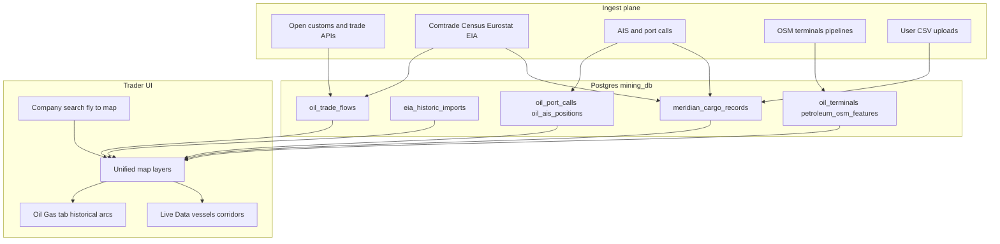
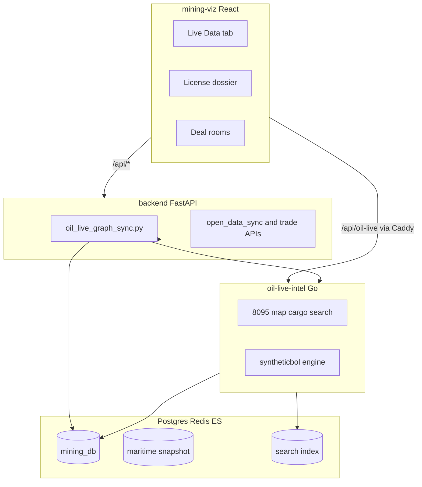

# AGENTS.md — Meridian commodity trading platform

**Audience:** Cursor agents and engineers working in this repository.  
**Product:** Meridian (MadSan Global Intelligence) — commodity trade enablement, not a map toy.  
**Operational detail:** [docs/DATA_SOURCES.md](docs/DATA_SOURCES.md), [docs/BOL_DATA_STRATEGY.md](docs/BOL_DATA_STRATEGY.md), [docs/LIVE_DATA.md](docs/LIVE_DATA.md).

---

## North star

> Make cross-border commodity trading as easy as using a modern SaaS product—powered by the widest defensible layer of **open, attributable data**, with clear honesty when data is macro, synthetic, or user-supplied.

**End purpose:** Users **discover** counterparties and corridors, **verify** claims with provenance, **price** deals with public context, and **execute** (suppliers, routes, deal packs, future RFQ flows) for **oil, refined products (diesel, gasoil, jet), LNG/LPG, and mining commodities** in the license graph, with a deliberate path to agriculture, metals, and chemicals.

**Strategic data ambition:** Build the **widest legal store of oil-product and mining trade intelligence on Earth**—crude, condensate, diesel, gasoil, jet, gasoline, naphtha, fuel oil, LPG, LNG, and related HS27 flows—by **connecting many open APIs and government datasets into Postgres**, not by leaving data ephemeral in memory. Mining cadastre and trade linkage must reach the same seriousness as petroleum Live Data.

**What we are not:**

- A scraper of ImportYeti, CBP portals, Panjiva, or paid broker UIs
- A black-box “AI confirmed deal” product
- A product that implies Mapbox, synthetic rows, or macro stats are confirmed customs manifests

**What we are building (ImportYeti-class UX, open-data spine):** The **same trader workflows** ImportYeti popularized—search by company, browse shipment-like rows, see corridors, compare importers/exporters—filled from **free government customs where published**, **macro trade APIs**, **AIS movement**, **user uploads**, and **high-volume synthetic MCR** where company-level manifests are not open. Label every row honestly; never pretend a macro Comtrade row is a BOL.

**Synthetic Meridian Cargo Records (MCR)** are **trader hypotheses** built from triangulated public signals—not customs manifests. Every MCR must keep `bol_tier`, confidence, `evidence_chain`, and disclaimers.

```mermaid
flowchart LR
  subgraph discover [Discover]
    Map[Unified map]
    Search[Search and corridors]
    Licenses[Licenses and terminals]
  end
  subgraph verify [Verify]
    Provenance[Source URLs and tiers]
    Screen[Sanctions and LEI]
    Macro[Macro trade validation]
  end
  subgraph price [Price and economics]
    Benchmarks[Public benchmarks]
    DealPack[Deal execution pack]
    Routes[Route planner]
  end
  subgraph execute [Execute]
    Suppliers[Suppliers CRM]
    Deals[Deal rooms]
    Export[CSV and audit export]
  end
  discover --> verify --> price --> execute
```



---

## Mission principles (read first)

| Principle | Agent behavior |
|-----------|----------------|
| **Trader outcomes** | Every feature must shorten time from “who ships what where” to an actionable next step: contact, route, deal pack, watchlist, export. |
| **Open data first** | Prefer public APIs, open government datasets, ODbL/OSM, UN/EU/US statistics. Record license, `data_source`, and `source_record_url` where applicable. |
| **Honest tiers** | Never remove tier labels, confidence scores, evidence chains, or disclaimers. Production defaults: `OIL_LIVE_DISABLE_DEMO_SEED=1`, `exclude_demo` on list APIs. |
| **No illegal ingest** | Do not scrape CBP manifests, ImportYeti, Panjiva, Descartes, or broker UIs. Licensed commercial feeds require explicit product and legal approval before wiring. |
| **Commodity breadth** | Design beyond HS chapter 27. When extending trade tables, prefer commodity-agnostic naming (`commodity_trade_flows`) over oil-only silos. |
| **Minimize scope** | Ship small vertical slices that advance the north star. Update [docs/DATA_SOURCES.md](docs/DATA_SOURCES.md) when adding or changing a source. |
| **Real data in prod** | Demo seed, bundled JSON, and `seed_port_calls` are dev/sparse-AIS fallbacks only—never the default production story. |
| **Persist everything defensible** | If an API returns attributable trade, movement, or infrastructure facts, design ingestion to **upsert into Postgres** (with `data_source`, `ingested_at`, raw JSON snapshot optional). Redis/ES are caches or indexes—not the system of record. |
| **Connect APIs creatively** | Agents should **chain** sources (e.g. AIS port call + Comtrade corridor + EIA product + GLEIF party + OSM terminal) to raise confidence—not stop at a single endpoint. |
| **Map-first** | Stored trade, infrastructure, and mining licenses must be **visible on the unified map** (layers, corridors, arcs, clusters)—not hidden in tables-only screens. |
| **Fast for users** | More data in the DB must **not** mean a heavier app. Ingest offline; serve **viewport-limited, aggregated** APIs; keep the UI snappy (see [Performance — non-negotiable](#performance--non-negotiable)). |

---

## How agents should work (mandatory mindset)

You are expected to be **clever, productive, and systems-thinking**—like a strong data/platform engineer reporting to the CEO, not a ticket-closing script runner.

| Behavior | Expectation |
|----------|-------------|
| **Outstanding thinking** | Before coding, sketch which APIs answer the trader question, what lands in which table, and what tier the UI shows. Propose the smallest slice that **grows the database**. |
| **Multi-API fusion** | One feature often needs 3–5 sources (movement + macro + party + geo). Wire them in graph-sync or a dedicated worker; log each step. |
| **Store in DB** | New ingests get migrations, idempotent upserts, sync run tables, and search indexing. “We called an API in the frontend” is unacceptable for trade or infrastructure facts. |
| **Oil products globally** | Think **worldwide HS 2709–2711** and national product breakdowns—not only U.S. or Gulf demos. |
| **Mining parity** | Mining licenses and flows are **first-class**, not a legacy map sidebar. Close gaps in [docs/DATA_SOURCES.md](docs/DATA_SOURCES.md) aggressively. |
| **Infrastructure creativity** | Tank farms, tank terminals, pipelines, refineries, and berths: combine OSM Overpass, national GIS, EIA/refinery lists, port authority open data, and storage-capacity proxies where direct BOLs do not exist. |
| **Honesty under scale** | Volume comes from **legal** ingestion and synthesis, not from removing tier labels. |
| **On the map** | Every new dataset gets a **map layer** (or corridor overlay) with a toggle in the layers panel—historical arcs, live vessels, pipelines, tank farms, mining polygons. |
| **Efficient delivery** | Heavy work in **workers/graph-sync**; map reads **bbox + limit** only; never ship whole tables to the browser. |

When stuck, add a row to DATA_SOURCES “gap” table and implement the adapter—not a hardcoded demo.

---

## Map-first delivery — put it on the map

**Rule:** If we store it for traders, they should **see it geographically** unless it is purely tabular metadata (e.g. sanctions JSON with no coords).

| Data type | Map representation | Layer / component patterns |
|-----------|-------------------|----------------------------|
| **Historical trade / EIA imports** | Great-circle or corridor arcs (origin → U.S. port / region) | `EiaHistoricMapLayer`; purple historic styling; tier = historic |
| **Live & synthetic cargo (MCR)** | Corridor arrows, opportunity markers | `OilLiveMapOverlays`, trade-flow layer; filter by tier |
| **Macro corridors** | Aggregated trade-flow lines (country ↔ country) | `mcr_corridor_aggregates`; avoid drawing raw Comtrade as thousands of points |
| **Terminals & tank farms** | Clustered points; zoom → detail | Map bbox API; cluster plugin; `terminal_type` filter |
| **Pipelines & refineries** | Linestrings / polygons (simplified at low zoom) | `petroleum_osm_features`; optional vector simplification by zoom |
| **Vessels (live)** | Moving or last-known markers; WebSocket throttled | AIS layer; merged positions; cap count per bbox |
| **Mining licenses** | Polygons on main map + dossier link | Existing license layers; tie trade-flow context in dossier |
| **Port calls** | Berth-linked events | Geofenced points; only in viewport |

**UX expectations:**

- **One map** for Live Data and petroleum context—not duplicate mini-maps per feature.
- **Layer panel** toggles: Historical, Live, Macro, Infrastructure (pipelines, storage, refineries), Trade flows, Vessels, Mining.
- **Click → light popup**; **View details** opens drawer (avoid re-render storms on every click).
- Pan/zoom triggers **debounced** fetches (see existing ~450ms bbox debounce in Live Data).

Agents adding ingest without a map layer should treat the task as **incomplete**.

---

## Performance — non-negotiable

The product will hold **millions** of rows in Postgres. Users must still get a **fast, light** web app. Scale data in the backend; keep the frontend lean.

### Golden rule

> **Bulk in the database, sparse on the wire, minimal in the DOM.**

| Layer | Do | Do not |
|-------|-----|--------|
| **Ingest / sync** | Batch upserts, indexes, corridor pre-aggregation (`mcr_corridor_aggregates`), async workers | Run 10+ minute sync in request path; N+1 API calls per row in sync |
| **API (Go/Python)** | `bbox`, `limit`, `offset`; server-side filters; simplified geometry at low zoom; HTTP caching headers where safe | Return full global dataset; unbounded `SELECT *`; huge GeoJSON in one response |
| **Search (ES)** | Indexed fields only; `limit` + `offset`; type filters | Reindex entire DB on every request |
| **Frontend** | Debounced bbox (450ms map, 300ms search); `keepPreviousData`; layer toggles off = no fetch; virtualized lists in drawer | Load all terminals/vessels worldwide; refetch drawer lists on every pan; thousands of Leaflet markers unclustered |
| **Realtime (AIS)** | WebSocket with caps; update positions in place; optional merge layer | Re-mount map layers on every tick |

### Targets agents should respect

- **Initial map paint:** &lt; 2s for default hub bbox after tab open (terminals + one overlay layer).
- **Pan/zoom refetch:** debounced; show stale layer until new data arrives (`keepPreviousData`).
- **Marker counts:** enforce server `limit` (e.g. 500–2000 per bbox—match existing map APIs); cluster beyond that.
- **Corridors:** prefer **aggregated** corridor table over rendering every MCR leg at world zoom.
- **Pipelines / tank farms:** load per viewport or pre-tiled; simplify lines (Douglas-Peucker or stored `geom_simplified`) for zoom &lt; 8.
- **Bundle size:** no new heavy chart/map libs without justification; lazy-load rare panels (deal pack, satellite).

### Existing patterns to reuse (do not reinvent slower)

- Live Data bbox debounce + `keepPreviousData` — [docs/LIVE_DATA.md](docs/LIVE_DATA.md) § Performance  
- `GET /api/oil-live/map?bbox=…&limit=…` — viewport-scoped features  
- `LiveDataSearchBar` — 300ms debounced ES search  
- Corridor aggregates — trade-flow layer instead of per-row arcs at low zoom  
- Separate **intel drawer lists** from map pan (no refetch opps list on every bbox change)

### Anti-patterns (reject in review)

- Drawing 19k terminal markers without clustering  
- Fetching cargo ledger with `limit=100000` for the map  
- Storing GeoJSON blobs in React state for the whole world  
- Adding a second map instance per tab  
- Blocking UI on graph-sync; use worker + status banner instead  

**CEO bar:** Traders choose Meridian because it is **rich and fast**, not rich and sluggish. When adding data volume, **always** add the efficient read path and map layer in the same PR.

---

## Global oil products — data we must hold in the database

**Product requirement:** Meridian needs **comprehensive oil-product coverage**—not only crude tankers on a map. Target state:

| Layer | Contents | Primary tables / APIs (extend as needed) |
|-------|----------|------------------------------------------|
| **Product taxonomy** | Crude, condensate, diesel/gasoil, jet, gasoline, naphtha, fuel oil, LPG, LNG, bitumen, petcoke | HS 2709/2710/2711 (+ national code maps); `commodity_family` on MCR and trade flows |
| **Historical trade** | What **happened**—bilateral flows, company-level historic imports (e.g. EIA impa), macro customs stats | `oil_trade_flows`, `eia_historic_imports`, future `trade_manifest_rows` from open customs |
| **Live / in-motion trade** | What is **happening now**—AIS, port calls, open port departures, synthetic MCR from live triangulation | `oil_ais_positions`, `oil_port_calls`, `meridian_cargo_records`, opportunities |
| **Infrastructure** | Tank farms, terminals, refineries, pipelines, storage tanks | `oil_terminals`, `petroleum_osm_features`, future `oil_storage_sites`, `oil_pipeline_segments` |
| **Parties** | Shipper/consignee candidates, traders, NOCs, refiners | `oil_companies`, enrichment columns, `supplier_id` links |

**UI alignment (Oil/Gas tab + Live Data):**

- **Oil/Gas (licenses & petroleum map):** Surface **historical** trade on the **same map** as licenses—corridor arcs, macro context popups—not only static polygons.
- **Live Data:** **Live** movement + **historic/synthetic cargo** as map layers (toggle Historical / Live / Macro); drawer for depth, map for spatial truth.
- **Single search:** Company and corridor search → fly map to hit + open drawer (Elasticsearch when enabled).
- **Infrastructure:** Tank farms, pipelines, refineries as **opt-in layers** (default off if heavy).

Agents implementing features should ask:

1. *Does this row land in Postgres?*  
2. *Does it appear on the map efficiently (bbox + layer toggle)?*  
3. *Will panning worldwide stay fast?*

---

## Live trade ledger — replicate ImportYeti value, not their data

ImportYeti’s product shape (company search → shipment list → supplier discovery) is the **UX bar**. Our **data bar** is: every row traceable to open government or attributable APIs, plus synthesis where manifests are closed.



| Ledger | Meaning | Sources to wire and store |
|--------|---------|----------------------------|
| **Historical shipments (manifest-like)** | Past trade the trader can research | EIA impa files; open customs bulk/API per country; macro disaggregation into MCR; user BOL CSV (`tier=user_upload`) |
| **Live shipments (in progress)** | Current voyages and port activity | AISStream; merged vessel positions; geofenced port calls; Recipe A–G on fresh port calls |
| **Macro corridors** | Country–country HS27 volume | Comtrade, Census, USITC, Eurostat roadmap, JODI validation |

**Scale targets (engineering):** Grow `meridian_cargo_records` and `oil_trade_flows` orders of magnitude via more graph-sync sources and country adapters—not demo seed. Expose counts in `sync-status` and admin dashboards.

---

## Mining — equal priority, currently underfed

Mining is **as important as oil** for this platform. Today’s gap is unacceptable for the north star: too few countries in `OPEN_DATA_SOURCES`, thin Comtrade linkage, and weak connection between **license polygons** and **trade flows**.

| Workstream | Action |
|------------|--------|
| **Cadastre expansion** | Add verified ArcGIS/API/CSV adapters for Kazakhstan, LatAm, MENA, West Africa per DATA_SOURCES §3 |
| **Trade linkage** | Extend `entity_trade_flows.py` HS mapping beyond petroleum; store flows in DB per license country/commodity |
| **Live Data crossover** | Terminals and ports that handle concentrate/coal/bulk; future MCR recipes for bulk vessel + license holder |
| **UX** | License dossier must show trade flows, procurement, and “verify at source” for mining records—not empty states |

Agents should **default to mining + oil** when adding ingest—not oil-only unless the task is explicitly petroleum.

---

## Infrastructure graph — tank farms, pipelines, terminals (be creative)

Traders need **where product is stored and moved**, not only dots on a map. Build an **infrastructure layer** in the database:

| Asset type | Open-data tactics |
|------------|-------------------|
| **Tank farms / liquid bulk storage** | OSM `industrial=storage_tank`, `man_made=storage_tank`, terminal relations; national port/storage GIS; link to `oil_terminals` with `terminal_type=storage` |
| **Refineries** | OSM `industrial=refinery`; EIA U.S. refinery list; national energy ministry datasets |
| **Pipelines** | OSM `man_made=pipeline` + `substance=*` Overpass (already policy in DATA_SOURCES); national regulator shapefiles when open |
| **Tankers vs terminals** | AIS draft/speed + berth geofence; separate map layers for **berth**, **STS zone**, **anchorage** |
| **Capacity proxies** | Where m³ capacity is unpublished, use tank count OSM tags, port authority throughput tables, or satellite-derived open datasets (document tier as inferred) |

Prefer **PostGIS geometry** in `petroleum_osm_features` or dedicated tables over Mapbox-only layers. Mapbox oilmap is optional Tier D—not the infrastructure spine.

**Map + performance:** Expose infrastructure via **viewport API** (simplified lines, `limit`, layer id). Tank farms and pipelines are **off by default** at world zoom; enable when user toggles layer or zooms in (z ≥ 9).

---

## Product pillars

| Pillar | Implemented today | Strategic gap (prioritize) |
|--------|-------------------|----------------------------|
| **Discover** | Live Data map, MCR corridors, license map, Elasticsearch search (`mining-viz/`, `oil-live-intel/`) | **World oil-product DB**; ImportYeti-style company/shipment search on stored rows; Oil/Gas tab fed by historical trade tables; global coverage banner |
| **Verify** | MCR evidence chain, OpenSanctions, GLEIF, Wikidata (`backend/services/`) | Eurostat/JODI corridor validation; “Verify at source” on every entity row with a URL |
| **Price** | Deal Execution Pack, commodity market snapshot (`mining-viz/src/lib/commodityMarket.ts`) | Free benchmark panel: EIA products, JODI, exchange delayed data only where ToS permits |
| **Execute** | Suppliers CRM, deal rooms, route planner deep links, watchlists/alerts | RFQ-lite, incoterms templates, counterparty readiness checklist export |
| **Comply** | Auth, activity logs, admin token, tier badges | Immutable audit trail on deal state changes; compliance-oriented export bundles |

When choosing work, ask: **which pillar does this advance, for which commodity, with what provenance?**

---

## Commodity scope

Meridian is **not oil-only**. New code should generalize where possible.

| Family | HS / scope | Primary signals today | Extend with |
|--------|------------|----------------------|-------------|
| **Crude & condensate** | 2709 | AIS, OSM terminals, Comtrade, Census, EIA crude, MCR recipes A–F | JODI, Eurostat, national customs open stats |
| **Refined products** | 2710 (diesel, gasoil, jet, gasoline) | EIA refinery throughput (Recipe G), macro trade flows | Product-level national stats; refinery OSM; corridor filters in UI |
| **LNG / LPG** | 2711 | Macro flows, terminals | LNG terminal registries, berth capacity where open |
| **Mining & metals** | License commodities + mapped HS | ArcGIS cadastre (`open_data_sync.py`), entity ↔ Comtrade via `entity_trade_flows.py` | **Major scale-up required** — more countries, flows in DB, port/bulk linkage, parity with oil Live Data |
| **Roadmap: agriculture** | FAO-relevant HS | — | FAO price index, USDA PSD, national export tables |
| **Roadmap: fertilizers & chemicals** | 28–31 | — | Same triangulation pattern as MCR: movement + macro + party |
| **Roadmap: base metals** | 26–27 adjacent | USGS MRDS fallback | Exchange public reports where license allows |

**Design check for every PR:** Does this help a trader move **diesel** or **copper licenses**, not only crude tankers?

---

## Open data strategy (wide catalog)

This is the **strategic** catalog. Operational inventory and verification steps live in [docs/DATA_SOURCES.md](docs/DATA_SOURCES.md).

### Tier A — Movement and infrastructure (highest trader value)

| Source class | Examples | Status in repo |
|--------------|----------|----------------|
| Live AIS | AISStream WebSocket, port-call geofence | Wired — `maritime-worker`, `oil-live-intel-worker` |
| Merged vessel positions | Redis snapshot + `oil_vessel_position_observations` | Opt-in — `OIL_LIVE_MERGED_VESSEL_POSITIONS` |
| Storage & pipelines | OSM terminals, Overpass pipelines/refineries | Wired — graph-sync OSM dedup |
| Tank farms / bulk storage | OSM storage tanks, terminal yards, national port GIS | **Priority gap** — dedicated ingest + `terminal_type` |
| Port authority stats | National open port throughput | **Research / gap** |
| Open customs manifests | Country APIs/bulk where legally published (EU, UK, BR, IN, etc.) | **Priority roadmap** — manifest-like rows in DB |
| IMO / VTS / EMSA | Where license explicitly permits redistribution | **Research only** |

### Tier B — Macro trade and prices (corridor truth)

| Source class | Examples | Status in repo |
|--------------|----------|----------------|
| UN Comtrade | HS 2709/2710/2711 | Wired — scheduled + graph-sync |
| U.S. Census | Bilateral HS27 | Wired — `census_trade.py` |
| USITC DataWeb | U.S. import/export HS | Wired — `usitc_dataweb.py` |
| EIA | Crude imports, refinery PADD, historic `impa*.xls` | Wired — `eia_imports.py`, `eia_historic_imports.py` |
| **Eurostat COMEXT** | EU27 HS aggregates | **Roadmap** — same macro tier as Comtrade |
| **JODI** | Global oil supply/demand | **Roadmap** — validates corridors |
| **IEA open tables** | Statistics where API/terms allow | **Roadmap** |
| UK / UNCTAD / World Bank | Bilateral and commodity prices | **Roadmap** |
| FAO / USDA | Food and ag prices | **Roadmap** |

### Tier C — Parties and risk

| Source class | Examples | Status in repo |
|--------------|----------|----------------|
| GLEIF LEI | Legal entity identifier | Wired — `gleif_batch.py` |
| Wikidata | Company facts | Wired — `wikidata_company_enrichment.py` |
| OpenSanctions | Screening chip (non-blocking) | Wired — `opensanctions_screening.py` |
| EU TED / USAspending | Procurement signals | Wired — Recipes C, E |
| SEC EDGAR | U.S. issuer filings | Partial — company endpoints |
| National company registers | Per-country open APIs | **Gap** — country-by-country |
| User / admin CSV | Suppliers, licenses | Wired — [LICENSE_BULK_IMPORT.md](LICENSE_BULK_IMPORT.md) |

### Tier D — Licensed or user-only (explicit opt-in)

| Source class | Policy |
|--------------|--------|
| Mapbox oilmap | Paid token; label as non-official; prefer OSM Overpass |
| Commercial BOL vendors | No scraping or republishing; optional licensed API with legal sign-off |
| OpenCorporates API | Paid — manual web check only unless licensed |
| Premium freight indices | Keys + ToS + UI tier label |

### Tier E — Synthetic intelligence

| Mechanism | Location |
|-----------|----------|
| MCR triangulation recipes **A–G** | `oil-live-intel/internal/services/syntheticbol/engine.go` |
| Corridor aggregates | `mcr_corridor_aggregates`, trade-flow map layer |
| Future | Per-commodity recipes (diesel hub, mining concentrate port pair) |

**Requirements for every new ingest:**

1. Public API URL or open government dataset with documented license  
2. `data_source` enum value and sync run logging (`*_sync_runs` or graph-sync step name)  
3. UI tier: `live` / `macro` / `synthetic` / `inferred` / `user_upload`  
4. One-line entry in [docs/DATA_SOURCES.md](docs/DATA_SOURCES.md)

---

## Architecture (where to change code)



| Layer | Path | Responsibility |
|-------|------|----------------|
| Frontend | [mining-viz/](mining-viz/) | Map, Live Data, drawers, Deal Execution Pack, search bar |
| API monolith | [backend/main.py](backend/main.py), [backend/services/](backend/services/) | Auth, licenses, graph-sync orchestration, ingest jobs |
| Trade graph service | [oil-live-intel/](oil-live-intel/) | Read APIs, MCR rebuild, migrations, search indexer |
| Edge proxy | [Caddyfile](Caddyfile) | Production `:8080` — same-origin `/api/oil-live/*` |
| Compose | [docker-compose.prod.yml](docker-compose.prod.yml) | Full prod stack; open **8080** and **5173** on cloud firewall |
| Diagnostics | [scripts/vm-live-data-diagnose.sh](scripts/vm-live-data-diagnose.sh) | VM health checks |

**Technical directives:**

- **Strangler pattern:** Expand Go (`oil-live-intel`) for read-heavy trade graph paths; keep Python for ingest orchestration unless profiling proves a hot path belongs in Go.
- **Graph-sync:** Prefer `oil-live-graph-sync-worker` or background job; avoid blocking HTTP clients for 10+ minute syncs in production.
- **Elasticsearch:** Index only — Postgres is source of truth; degrade search UI gracefully when ES is down.
- **Secrets:** GitHub Actions → `backend.env` on VM; never commit keys. Admin routes use header `X-Admin-Token`.
- **No full monolith rewrite:** Incremental extraction beats a big-bang Go migration.

---

## Prioritization rubric

Score candidate tasks 1–5 on each dimension, then prefer highest **trader value × legality × reuse**:

| Dimension | Question |
|-----------|----------|
| **Trader value** | Does this help close a deal, find a counterparty, or price a corridor? |
| **Open-data legality** | Is there a documented public API or open license? |
| **Coverage gap** | Does DATA_SOURCES list this country/source as unavailable? |
| **Cross-commodity reuse** | Does diesel, mining, or ag benefit from the same schema/UI? |
| **Operational risk** | Sync failures, TLS upstream, firewall, migration safety? |

**Deprioritize:** cosmetic map-only changes without provenance; paid BOL scraping; demo seed in production; features that hide `bol_tier`.

**Near-term CEO priorities (engineering backlog):**

1. **Grow the trade ledger in Postgres** — historical + live MCR on the **map** (layers + arcs); bbox-efficient APIs; Oil/Gas tab wired to stored flows  
2. **Global oil products** — HS 2710/2711 product filters; all major bilateral macro sources ingested and stored  
3. **Open customs adapters** — country-by-country government export/import APIs where license permits storage  
4. **Infrastructure DB** — tank farms, pipelines, refineries from OSM + national GIS (not Mapbox-only)  
5. **Mining scale-up** — Kazakhstan, LatAm, Africa cadastre + Comtrade linkage per commodity  
6. Eurostat + JODI ingest; async graph-sync worker on VM  
7. Legal user manifest CSV upload (`tier=user_upload`)  

---

## Repo map (quick navigation)

| Area | Path |
|------|------|
| Live Data UI | `mining-viz/src/features/live-data/`, `mining-viz/src/components/petroleum/` |
| Map overlays / corridors | `mining-viz/src/components/petroleum/OilLiveMapOverlays.tsx` |
| Commodity helpers | `mining-viz/src/lib/commodityMarket.ts`, `licenseHeroImage.ts` |
| Graph sync | `backend/services/oil_live_graph_sync.py` |
| Trade / EIA / screening | `backend/services/eia_imports.py`, `census_trade.py`, `usitc_dataweb.py`, `opensanctions_screening.py`, `gleif_batch.py` |
| License ingest | `backend/services/ingest/open_data_sync.py` |
| MCR engine | `oil-live-intel/internal/services/syntheticbol/engine.go` |
| Migrations | `oil-live-intel/migrations/` |
| Deploy workflow | `.github/workflows/docker-image.yml` |

---

## Quality bar for changes

**UI / map**

- Show tier badges (Synthetic / Macro / Live) and coverage health when sync-status is available  
- Link to `source_record_url` or external verify URL when data provides it  
- Do not open drawers on every map click—use explicit “View details” for heavy panels  
- **New stored data → map layer + toggle** (historical arcs, live markers, infra lines)  
- Cluster or cap markers; aggregate corridors at low zoom  

**Performance (required for merge)**

- Map fetches use **bbox + limit**; debounce pan (~450ms)  
- Lists in drawer: paginate; do not reload full ledger on map move  
- No unbounded JSON payloads; measure response size when adding a source  
- Graph-sync and bulk ingest stay in **workers**, not user-facing request path  

**API**

- Paginate list endpoints; cap map bbox `limit`  
- Extend `sync-status` when adding new graph layers (terminal count, corridor coverage, last sync time)  
- `exclude_demo` / `exclude_seed` on opportunity and cargo lists by default  
- Add DB indexes for geo queries (`lat/lng`, bbox, `updated_at`) with new tables  

**Docs**

- Update [docs/DATA_SOURCES.md](docs/DATA_SOURCES.md) and [docs/LIVE_DATA.md](docs/LIVE_DATA.md) when ingest or env keys change  

**Security**

- No credentials in git; use `.env` / `backend.env` / GitHub Secrets  
- Sanctions and enrichment are **signals**, not auto-block unless product explicitly requires it  

---

## Twelve-month strategic themes

| Horizon | Theme | Outcomes |
|---------|-------|----------|
| **Q1–Q2** | World oil-product store in DB | All HS27 products; historical ledger (EIA + customs + macro); live ledger (AIS + MCR); ImportYeti-style company search on **stored** rows |
| **Q1–Q2** | Infrastructure graph | Tank farms, pipelines, refineries, berths in Postgres; map layers from OSM/national GIS |
| **Q2–Q3** | Mining at parity | 2×+ license countries; trade flows per commodity; bulk/port linkage for concentrates |
| **Q3–Q4** | Execution & benchmarks | Free benchmark panel; counterparty readiness; RFQ-lite in deal rooms |
| **Continuous** | Customs + cadastre | Every country with open customs or mining portal gets an adapter; everything logged in sync runs |

---

## BOL and ImportYeti positioning (summary)

Full policy: [docs/BOL_DATA_STRATEGY.md](docs/BOL_DATA_STRATEGY.md).

| ImportYeti capability | Meridian equivalent (legal, open-data) |
|-----------------------|----------------------------------------|
| Search US importer by name | Company graph + historic EIA + MCR + GLEIF/Wikidata; Elasticsearch on stored rows |
| Shipment list per company | `meridian_cargo_records` + `eia_historic_imports` + future open customs rows |
| “Who supplies whom” | MCR corridors, Comtrade macro, procurement (TED/USAspending), license holders |
| Live activity | AIS port calls, opportunities, live tier on map |
| **Not available free** | Scraping CBP/ImportYeti/brokers — use synthesis + government open data + user upload |

- **Replicate the product shape**, not proprietary databases.  
- **High-volume rows in Postgres** from triangulation + customs + macro + uploads.  
- User-uploaded manifests/CSVs welcome when **consent and license** are clear—`tier=user_upload`.  
- Success = traders find counterparties and corridors **as easily as ImportYeti**, with **verify-at-source** honesty.

---

## Production operations (agents debugging VMs)

```bash
# On VM — stack health
docker compose -f docker-compose.prod.yml ps caddy frontend oil-live-intel backend
curl -s -o /dev/null -w "%{http_code}\n" http://127.0.0.1:8080/
curl -sf http://127.0.0.1:8080/api/oil-live/sync-status | jq .terminal_count

# Graph populate (prefer worker, not long curl)
docker compose -f docker-compose.prod.yml exec -T backend python -c \
  "from oil_live_graph_sync_worker import run_once; run_once()"
```

Browser: `http://<PUBLIC-IP>:8080` (not `https` unless TLS configured on 8443). If the browser times out but localhost works, open cloud firewall **TCP 8080** and **5173**.

---

## When in doubt

1. Read [docs/LIVE_DATA.md](docs/LIVE_DATA.md) for Live Data behavior.  
2. Read [docs/DATA_SOURCES.md](docs/DATA_SOURCES.md) before adding an ingest.  
3. Prefer **trader workflow** over **map pixels**.  
4. **Connect APIs → upsert Postgres → map layer (bbox-efficient) → drawer/search** in that order.  
5. Ask: *historical (Oil/Gas) or live (Live Data)—or both?* *Will the map stay fast at 10× data?*  
6. Label honestly; ship small; widen open data defensibly; **never** leave world oil-product or mining trade knowledge only in transient API responses or table-only UI.
