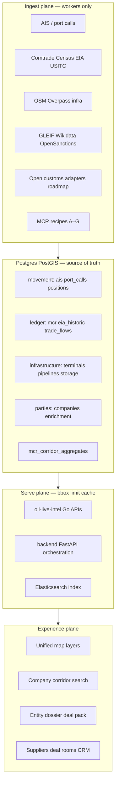
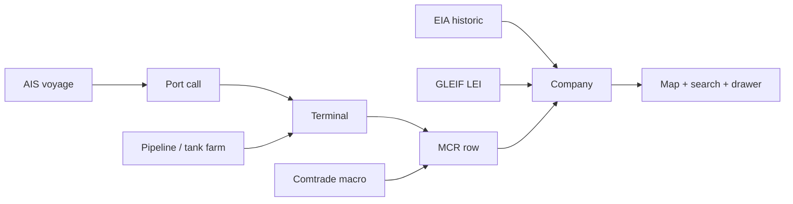

# Meridian platform architecture (2026)

**Purpose:** Let every user **discover → verify → price → execute** oil and commodity deals fast, with the widest **legal** free-data spine (ImportYeti-class UX, honest tiers—not paid manifest scraping).

**Formal decision record:** [ADR-0001: Oil & commodity platform architecture](./adr/0001-oil-commodity-platform-architecture.md) (MAD-44).

**Audience:** Engineering, product, CEO/Paperclip planning. Operational detail stays in [DATA_SOURCES.md](./DATA_SOURCES.md), [LIVE_DATA.md](./LIVE_DATA.md), [BOL_DATA_STRATEGY.md](./BOL_DATA_STRATEGY.md).

---

## 1. Product promise (what “great” means)

| User question | Meridian answer (with tier label) |
|---------------|-----------------------------------|
| Who is on this vessel / who loaded it? | AIS + port call + terminal geofence + MCR party candidates + GLEIF/Wikidata |
| Who imports this product on this corridor? | Historic EIA/Comtrade/customs-open + MCR + company search |
| Where is product stored / moved? | Terminals, tank farms, pipelines, refineries (OSM + national GIS) |
| Is this counterparty risky? | OpenSanctions signal, procurement, macro validation—not auto-block |
| Can we close a deal faster/cheaper? | Deal pack: route, benchmarks, supplier-buyer match score, corridor economics |
| What happened historically? | `eia_historic_imports`, macro flows, future open customs rows |

**Non-goals:** Scraping ImportYeti/CBP/Panjiva; pretending macro rows are BOLs; loading the world in the browser.

---

## 2. Target architecture (four planes)

### 2.1 Movement plane (live)

| Entity | Tables / APIs | Map |
|--------|---------------|-----|
| Vessel positions | `oil_ais_positions`, Redis snapshot | AIS layer, bbox cap |
| Port calls / load-discharge | `oil_port_calls`, geofenced terminals | Berth events |
| Voyage context | Linked to MCR `mmsi`, terminals | Corridor arcs |

**Cross-match:** port call + draft/speed + terminal `terminal_type` → infer load/discharge hypothesis (tier: `inferred` / `synthetic`).

### 2.2 Trade ledger plane (historic + synthetic + future customs)

| Tier | Storage | UX label |
|------|---------|----------|
| Historic manifest-like | `eia_historic_imports`, open customs rows | Historic |
| Macro corridor | `oil_trade_flows`, Comtrade/Census | Macro |
| Synthetic hypothesis | `meridian_cargo_records` (MCR) | Synthetic |
| User upload | MCR `tier=user_upload` | User |
| Live triangulation | MCR recipes on fresh port calls | Live / Synthetic |

**ImportYeti parity:** Company search → shipment-like list → corridor map → “verify at source” URL. Rows always show `bol_tier`, confidence, `evidence_chain`.

### 2.3 Infrastructure plane

| Asset | Source strategy | Table / layer |
|-------|-----------------|---------------|
| Terminals / berths | OSM, port authorities, dedup | `oil_terminals` |
| Tank farms / storage | OSM `storage_tank`, national GIS | `petroleum_osm_features`, `terminal_type=storage` |
| Pipelines | OSM `man_made=pipeline` | Linestrings, simplified by zoom |
| Refineries | OSM + EIA lists | Points/polygons |

**Default:** infrastructure layers **off** at world zoom; on at z ≥ 9 or explicit toggle.

### 2.4 Party & deal intelligence plane

| Capability | Implementation |
|------------|----------------|
| Company graph | `oil_companies`, GLEIF, Wikidata enrichment |
| Screening | OpenSanctions (signal chip) |
| Deal opportunities | Scoring: corridor fit, distance, macro spread, procurement signals |
| Execution | Deal Execution Pack, route planner, suppliers CRM, deal rooms |

**Deal insights (supplier ↔ buyer):** Batch jobs compute **hypothesis scores** (not “AI confirmed deal”):

- Corridor overlap (macro + MCR)
- Landed cost proxy (benchmark + route days)
- Counterparty readiness (LEI present, sanctions clear)
- Storage/terminal proximity (infra graph)

Store in `deal_opportunity_signals` (roadmap table) or extend opportunities with `signal_json` + provenance.

---

## 3. Cross-matching graph (the “ImportYeti without paying” engine)

**Recipes (existing MCR A–G, extend per product):**

| Recipe | Signals | Product families |
|--------|---------|------------------|
| A–F | AIS + macro + parties | Crude, clean products |
| G | EIA refinery PADD | Diesel/gasoil hub |
| New H | Storage OSM + port throughput | Tank farm ↔ vessel |
| New I | Pipeline endpoint + terminal | Landed cost corridors |

Every edge stores: `data_source`, `source_record_url`, `confidence`, disclaimer text.

---

## 4. Read path & performance (non-negotiable)

| Rule | Implementation |
|------|----------------|
| Bulk in DB, sparse on wire | Ingest in workers; never full-table to browser |
| Map | `GET /api/oil-live/map?bbox=&limit=`; debounce 450ms; `keepPreviousData` |
| Corridors | Prefer `mcr_corridor_aggregates` at low zoom |
| Search | ES with `limit`; degrade if down |
| Drawers | Paginate; no refetch drawer on every pan |
| Go expansion | Hot read paths → `oil-live-intel`; Python keeps orchestration |

**Targets:** Initial map paint &lt; 2s; pan refetch debounced; marker caps 500–2000/bbox.

---

## 5. UI / UX information architecture

One **unified map** (not per-feature mini-maps). Layer panel:

| Group | Layers | Default |
|-------|--------|---------|
| Live | Vessels, port calls, live MCR | Hub on |
| Historic | EIA arcs, historic corridors | Toggle |
| Macro | Country–country aggregates | Toggle |
| Infrastructure | Pipelines, tank farms, refineries | Off until zoom |
| Trade | Company corridors, opportunities | Contextual |

**Primary flows:**

1. **Search** company or vessel → fly map → open drawer (explicit “View details”).
2. **Click vessel** → popup: name, MMSI, last port, linked MCRs, tier badges.
3. **Click terminal** → storage/berth type, linked flows, verify link.
4. **Deal pack** → PDF/MD export: parties, route, benchmarks, tier legend.

**UX principles:** Honest tiers visible everywhere; no drawer on every map click; keyboard-friendly search; mobile-safe layer toggles (progressive).

---

## 6. Service boundaries (strangler to Go)

| Today | Target |
|-------|--------|
| `backend` graph-sync, ingest | Stays orchestration + admin |
| `oil-live-intel` map, MCR, search | All bbox-heavy reads + MCR rebuild |
| `mining-viz` | Thin client; React Query; virtualized lists |

**Go migration candidates (when profiled):** map features, cargo search, corridor aggregates, company shipment lists.

**Do not:** Big-bang rewrite; duplicate business logic in frontend.

---

## 7. Phased delivery (CEO backlog)

### Phase 0 — Fleet stable (now)

- Paperclip agents runnable (permissions, adapters, CEO recovery).
- `paperclip2` branch; no idle token burn.

### Phase 1 — Trader-visible ledger (8–12 weeks)

| Deliverable | Outcome |
|-------------|---------|
| Vessel → port call → MCR linkage on map | “Who loaded this vessel” |
| EIA historic + macro on same map | Historic context |
| Company search → drawer shipment list | ImportYeti-shaped |
| Infrastructure layer (OSM pipes + storage) | Tank farms / pipelines |
| `sync-status` honest counts | Trust |

### Phase 2 — Deal intelligence (12–20 weeks)

| Deliverable | Outcome |
|-------------|---------|
| Supplier–buyer opportunity scorer | Cost/time insights |
| Product filters HS2710 families | Diesel, gasoil, VLSFO, gasoline |
| Open customs adapter #1 (EU/UK/BR/IN pick one) | Real manifest-like rows |
| Deal pack v2 | Export for traders |

### Phase 3 — Scale & polish (20+ weeks)

| Deliverable | Outcome |
|-------------|---------|
| More customs countries | Density |
| Eurostat + JODI validation | Corridor truth |
| RFQ-lite in deal rooms | Execute pillar |
| UI performance budget CI | Regression guard |

---

## 8. Data acquisition priorities (free only)

| Priority | Source class | Trader value |
|----------|--------------|--------------|
| P0 | AIS + port geofence | Live vessel truth |
| P0 | EIA impa + Comtrade/Census | Historic + macro |
| P0 | OSM terminals/pipelines/storage | Infrastructure |
| P1 | GLEIF + Wikidata + OpenSanctions | Parties |
| P1 | EU/UK/BR open customs | Company-level history |
| P2 | National port throughput tables | Volume validation |
| P2 | JODI / Eurostat | Product-level macro |

See [DATA_SOURCES.md](./DATA_SOURCES.md) gap table—add a row before coding a new adapter.

---

## 9. Honesty & compliance

- Every row: `bol_tier`, confidence, evidence chain, disclaimer.
- Production: `OIL_LIVE_DISABLE_DEMO_SEED=1`, `exclude_demo` on lists.
- MCR ≠ customs manifest—always labeled.
- Sanctions = signal, not auto-block (unless product policy changes).

---

## 10. Paperclip agent roles (build the platform, don’t block it)

| Agent | Builds |
|-------|--------|
| CEO (Cursor) | Issues, assign, unblock, hire within fleet caps |
| **Codex Product Manager** | Backlog, PRDs, acceptance criteria, Phase 1 epic splits |
| Cursor Engineer | Map UI, drawers, performance |
| OpenRouter Engineer | Backend ingest, APIs |
| CTO (Ollama) | ADRs, schema, compose |
| Meridian Architect (Ollama) | Fleet health only—not product code |
| OpenClaw | Research, vault notes |

**Platform epic issues** should slice Phase 1 vertically: *ingest → Postgres → map layer → drawer* per feature.

---

## 11. Immediate engineering actions

1. Run `bash scripts/paperclip-fix-adapters.sh` after any Paperclip image change.
2. Unblock stranded issues: `todo` + **New run** (not Retry).
3. Break “make the system great” into Phase 1 child issues (see §7)—one vertical slice per sprint.
4. First slice recommendation: **Vessel detail drawer with port calls + MCR parties + tier badges** (highest demo value).

---

*This document supersedes ad-hoc architecture notes for planning; update when schema or phase boundaries change.*
