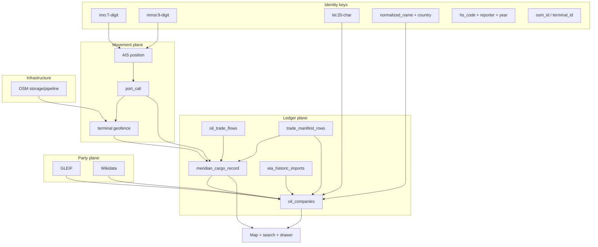

# Open-data matrix — vessels, trade parties, tank farms, pipelines

| Field | Value |
|-------|-------|
| **Issue** | MAD-45 (parent [MAD-43](../MAD/issues/MAD-43)) |
| **Status** | Planning deliverable — **no ingest code** in this issue |
| **Branch** | `paperclip2` |
| **Date** | 2026-05-23 |
| **Related** | [ADR-0001](./adr/0001-oil-commodity-platform-architecture.md), [DATA_SOURCES.md](./DATA_SOURCES.md), [BOL_DATA_STRATEGY.md](./BOL_DATA_STRATEGY.md) |

## 1. Scope

Inventory **free/open** sources that let Meridian answer, with honest tiers:

| User question | Required entities |
|---------------|-------------------|
| Who is this vessel? | MMSI, IMO, name, type, flag |
| Who loaded / discharged? | Shipper, exporter, consignee, importer (company graph) |
| Where is product stored / moved? | Terminals, tank farms, pipelines, refineries |
| What trade happened? | Manifest-like rows, macro corridors, synthetic MCR |

**Out of scope for this doc:** paid broker APIs, CBP/ImportYeti scraping, implementation tickets (see §6).

---

## 2. DATA_SOURCES matrix (MAD-45 acceptance)

Legend — **Tier:** `live` | `historic` | `macro` | `synthetic` | `inferred` | `user_upload`  
**Refresh:** cron/worker interval or event-driven.  
**Match keys:** primary join keys for cross-matching (§3).

### 2.1 Vessels & movement

| Source ID | Source | License | Refresh | Key fields | Match keys | Tier | In repo |
|-----------|--------|---------|---------|------------|------------|------|---------|
| `aisstream` | AISStream WebSocket | Commercial API ToS; key required | Real-time (~30s) | `mmsi`, `imo`, `name`, `lat`, `lng`, `sog`, `cog`, `destination` | `imo:NNNNNNN` → `mmsi` fallback (`vesselmerge.VesselIdentityKey`) | `live` | Yes — `oil-live-intel-worker`, `oil_ais_positions` |
| `maritime_redis` | Redis global snapshot (retired) | — | — | Same as AIS + `data_source` | `imo:` / `mmsi` | `live` | Historical rows only — Python `maritime-worker` removed |
| `oil_vessels` | Vessel registry (seed + AIS backfill) | App + public AIS | On graph-sync | `mmsi`, `imo`, `name`, `tanker_class`, `dwt` | `imo`, `mmsi`, normalized `name` | `live` / `inferred` | Yes — `oil-live-intel` |
| `port_calls` | Geofenced berth events | Derived from AIS | Per port call | `mmsi`, `imo`, `terminal_id`, `event_type`, `draft`, `event_at` | `mmsi` + `terminal_id` + time window | `live` / `inferred` | Yes — `oil_port_calls` |
| `aishub` | AISHub (contributor) | Free with receiver share | Planned | `mmsi`, `imo`, position | `imo`, `mmsi` | `live` | **Gap** — documented in DATA_SOURCES |
| `barentswatch_ais` | Norway govt AIS | Open gov (regional) | Graph-sync when creds set | Position, name | `mmsi`, `imo` | `live` | Yes — `barentswatch_ais_sync.py` (regional only) |
| `sentinel1_sar` | Copernicus SAR detections | Copernicus ToS | Batch | Lat/lon, time | Geo + time only (no IMO) | `inferred` | **Gap** — unidentified traffic only |
| `equasis` | IMO public registry | Web — **no bulk API** | Manual / research | `imo`, flag, manager | `imo` | `historic` | **Gap** — manual verify links only |

### 2.2 Trade parties (companies)

| Source ID | Source | License | Refresh | Key fields | Match keys | Tier | In repo |
|-----------|--------|---------|---------|------------|------------|------|---------|
| `gleif_lei` | GLEIF LEI API | Open LEI | Graph-sync batch | `lei`, legal name, country | `lei` exact; `normalized_name` + country | `historic` | Yes — `gleif_batch.py` |
| `wikidata` | Wikidata API | CC0 | Graph-sync batch | `qid`, industries, HQ, website | `lei` (P1278), name fuzzy | `historic` | Yes — `wikidata_company_enrichment.py` |
| `opensanctions` | OpenSanctions API | Open; key optional | Graph-sync batch | `entity_id`, aliases, countries | Name fuzzy + country | `historic` | Yes — screening chip only |
| `oil_companies` | App company graph | Mixed | Graph-sync | `id`, `name`, `normalized_name`, `country`, `lei` | `normalized_name`, `lei`, `supplier_id` | `synthetic` / `user_upload` | Yes |
| `eia_historic_impa` | EIA company import files | US govt open | Folder ingest | Importer, origin, product, port, volume | `normalized_name` + US + product | `historic` | Yes — `eia_historic_imports` |
| `sec_edgar` | SEC EDGAR | US public | On demand | CIK, issuer name | Name + US listing | `historic` | Partial — `sec-filings` endpoint |
| `company_registers` | National register URLs | Manual links | Static | Register URL, jurisdiction | Country + name (human) | — | Yes — `company_registers.py` (no API) |
| `usa_spending` | USAspending | US open | Weekly | `award_id`, recipient name | Name fuzzy → `oil_companies` | `macro` | Yes — Recipe E |
| `eu_ted` | EU TED procurement | EU open | Weekly | Notice ID, buyer, CPV | Name fuzzy + CPV bucket | `macro` | Yes — Recipe C |
| `opencorporates` | OpenCorporates | **Paid API** | — | — | — | — | **Excluded** — manual link only |

### 2.3 Tank farms, terminals, pipelines

| Source ID | Source | License | Refresh | Key fields | Match keys | Tier | In repo |
|-----------|--------|---------|---------|------------|------------|------|---------|
| `osm_terminals` | OSM + Overpass dedup | ODbL | Nightly worker | `osm_id`, `name`, `lat`, `lng`, `terminal_type` | `osm_id`; geohash + name within 500m | `inferred` | Yes — `oil_terminals`, graph-sync |
| `osm_storage_tank` | OSM `man_made=storage_tank` | ODbL | Nightly | Way/node id, tags, geometry | `osm_id`; terminal geofence | `inferred` | Yes — `petroleum_osm_features` |
| `osm_pipeline` | OSM `man_made=pipeline` | ODbL | Nightly | Way id, `substance`, geometry | `osm_id`; endpoint proximity to terminal | `inferred` | Yes — bbox map layer |
| `osm_refinery` | OSM `industrial=refinery` | ODbL | Nightly | Point/polygon | `osm_id`; PADD/country | `inferred` | Yes |
| `eia_refinery_padd` | EIA weekly PADD | US govt | Weekly | PADD, utilization, crude input | PADD code → US Gulf terminals | `macro` | Yes — Recipe G |
| `mapbox_oilmap` | Mapbox oilmap MVT | **Paid** Mapbox | Static ~2019 | Layer features | — | `inferred` | Optional — `PETROLEUM_DISABLE_MAPBOX=1` preferred |
| `national_gis_storage` | KZ, US, EU national GIS | Varies | **Gap** | Licence polygons, tank farms | Country-specific ID | `historic` | Per-country probes only |
| `port_authority_curated` | Port authority major-customer pages | Public marketing web | Git + graph-sync | Tenant name, category, locode | `normalized_name` + country → `oil_companies` | `curated_reference` (directory) | Yes — `data/port_authority_directories.json`, `/api/ports/{locode}/directory` |

### 2.4 Trade / manifest-like & macro

| Source ID | Source | License | Refresh | Key fields | Match keys | Tier | In repo |
|-----------|--------|---------|---------|------------|------------|------|---------|
| `comtrade` | UN Comtrade | UN terms | Daily worker | Reporter, partner, HS, year, qty | M49 country + HS + year | `macro` | Yes — `oil_trade_flows` |
| `census_api` | US Census intl trade | US open | Graph-sync | US HS27 bilateral | Country + HS + period | `macro` | Yes |
| `usitc_dataweb` | USITC DataWeb | Account ToS | Graph-sync | US HS flows | Country + HS | `macro` | Yes |
| `eia_crude_imports` | EIA API v2 | US govt | Graph-sync | Origin country, volume | Country + month | `macro` | Yes |
| `eurostat_comext` | Eurostat | EU open | Graph-sync | EU27 HS27 | Reporter + partner + HS | `macro` | Yes — `eurostat_trade.py` |
| `jodi` | JODI CSV | JODI terms | Graph-sync | Country product balance | Country + product | `macro` | Yes |
| `uk_hmrc_open` | UK HMRC CSV dir | UK OGL | On file drop | Importer, exporter, HS, value | `normalized_name` + HS + period | `historic` / `customs_open` | Partial — `trade_manifest_rows` |
| `uk_ons_macro` | ONS bilateral JSON | UK open | On sync | Country pair macro | Country codes | `macro` | Yes — not company BOL |
| `user_manifest_csv` | User upload | Consent | On upload | Shipper, consignee, HS, vessel | Name + optional `imo` column | `user_upload` | Yes |
| `brazil_comexstat` | Comex Stat / MDIC | Brazil open gov | **Gap** | NCM, company, port | CNPJ + NCM + period | `historic` | **Priority P1** |
| `india_dgft` | DGFT / ICEGATE bulk | India govt | **Gap** | Importer IEC, HS | IEC + HS + port | `historic` | **Priority P1** — license verify |
| `eu_intrastat` | EU Intrastat microdata | Restricted | **Gap** | — | — | — | Not free at company level |
| `us_cbp_ams` | CBP AMS manifests | **Restricted** | — | BOL fields | IMO + manifest id | — | **Paid tier only** |

### 2.5 Synthetic ledger (MCR)

| Source ID | Source | License | Refresh | Key fields | Match keys | Tier | In repo |
|-----------|--------|---------|---------|------------|------------|------|---------|
| `mcr_recipes_a_g` | Synthetic BOL engine | Synthesis | MCR rebuild job | `shipper_*`, `consignee_*`, `mmsi`, `imo`, corridors | All §3 keys | `synthetic` | Yes — `syntheticbol/engine.go` |
| `mcr_recipe_h` | Storage OSM + throughput | Planned | Batch | Terminal ↔ vessel | Terminal geofence + tank tags | `inferred` | **Roadmap** |
| `mcr_recipe_i` | Pipeline endpoint | Planned | Batch | Pipeline ↔ terminal | OSM endpoint + terminal | `inferred` | **Roadmap** |

---

## 3. Cross-match strategy

Goal: ImportYeti-shaped UX (**company → shipment list → map**) without paid manifests.



### 3.1 Match key precedence

| Step | From | To | Algorithm | Min confidence |
|------|------|-----|-----------|----------------|
| 1 | AIS / positions | `oil_vessels` | `imo` exact → else `mmsi` | 0.95 |
| 2 | `port_call` | `oil_terminals` | Point-in-polygon + `terminal_type` | 0.85 |
| 3 | `port_call` + draft Δ | MCR load/discharge | Recipe A/B rules in `engine.go` | 0.55–0.75 |
| 4 | `trade_manifest_rows` | `oil_companies` | `normalize(name)` + country; optional LEI column | 0.80 if LEI |
| 5 | `eia_historic_imports` | `oil_companies` | US importer name normalize | 0.75 |
| 6 | Manifest / MCR | Vessel | `imo` column → else `vessel_name` token match + `mmsi` from port call window | 0.60 |
| 7 | Macro flow | MCR corridor | Reporter/partner M49 + HS + year band | 0.50 (macro only) |
| 8 | Company search | All | ES `name^3`, `normalized_name^2`; PG fallback `ILIKE` | N/A |

### 3.2 Fuzzy company name rules

Use existing `resolveCompany` pattern (`normalized_name = lower(trim(name))`):

1. **Exact** `normalized_name` + country (current).
2. **Alias table** (roadmap): store `company_aliases(alias, company_id, source)` from Wikidata aliases + manifest variants.
3. **Token Jaccard ≥ 0.85** on significant tokens (drop `ltd`, `llc`, `sa`, `gmbh`, `pte`).
4. **LEI override**: if manifest row carries LEI, match LEI first (confidence 0.95).
5. **Never auto-merge** across countries unless LEI agrees.
6. **Sanctions**: OpenSanctions hit lowers display confidence, does not block merge.

### 3.3 Vessel ↔ BOL ↔ party chain

| Link | Free-data method | UI tier label |
|------|------------------|---------------|
| Vessel → loader | Port call at load terminal + Recipe A + `shipper_name` candidate | `synthetic` / `live` |
| Vessel → importer | Discharge port call + historic manifest row if exists | `historic` when manifest |
| BOL row → vessel | `imo` / `vessel_name` + time overlap with `oil_port_calls` | `historic` or `synthetic` |
| Party → shipments | `oil_companies.id` → `meridian_cargo_records.shipper_company_id` | Per `bol_tier` |
| Tank farm → vessel | Terminal geofence match + Recipe H (storage tags) | `inferred` |

**Hard rule:** Comtrade/Census/Eurostat rows **must not** surface as company-level BOL in search; only as macro corridor validation or MCR evidence line.

---

## 4. Gaps & honest paid-tier fallbacks

| Gap | Free coverage today | Paid fallback (label honestly) | Meridian stance |
|-----|---------------------|--------------------------------|-----------------|
| US company-level ocean BOL | EIA impa (imports to US), macro Census | Descartes, Panjiva, ImportGenius subscription | **Do not scrape**; MCR + EIA only |
| EU company manifests | Macro Eurostat; TED procurement | Broker datasets; country-specific paid APIs | Open customs CSV where published |
| Global AIS gaps | Coastal holes; no inland | Spire, MarineTraffic API | AISHub contributor path; regional govt AIS |
| Tank farm capacity | OSM tag counts | Rystad, IHS storage | Show `inferred` capacity band |
| Pipeline throughput | OSM geometry only | Genscape, industry maps | Landed-cost **proxy** only |
| Company registry depth | Manual links + GLEIF | OpenCorporates API, Bureau van Dijk | GLEIF + Wikidata + user CSV |
| Sanctions legal opinion | OpenSanctions signal | Refinitiv World-Check | Signal chip, not legal advice |
| Real-time product specs | — | Assay labs, broker quotes | Benchmarks (EIA/JODI) only |

---

## 5. Customs adapter #1 recommendation (unblocks MAD-4x-c)

| Rank | Country | Source | Why | Risk |
|------|---------|--------|-----|------|
| **1 (pick)** | **United Kingdom** | HMRC bulk CSV + existing `UK_MANIFEST_CSV_DIR` scaffold | Infrastructure exists (`trade_manifest_rows`); English names; aligns with CEO Gulf/EU trade | Sample data may be macro-only until real CSV procured |
| 2 | Brazil | Comex Stat / MDIC exports | High crude/product volume; company names often present | NCM mapping, Portuguese normalization |
| 3 | India | DGFT / ICEGATE | Huge import market | License verification; rate limits |
| 4 | EU (NL/BE) | Intrastat not free; use **Eurostat** macro only | Already wired | Not manifest-level |

**Decision for MAD-4x-c:** Implement **UK open manifest CSV** adapter first (extend `trade_manifest_ingest.py`), with explicit `bol_tier=customs_open` and `source_record_url` per row. Brazil as **MAD-4x-c2** child.

---

## 6. Implementation child issues (after plan approval)

CEO `request_confirmation` still **pending** on MAD-45; one child shipped early from matrix §2.1.

| ID | Title | Owner | Status |
|----|-------|-------|--------|
| **MAD-61** | Vessel open-data adapter stub (`barentswatch_ais`) | OpenRouter Engineer | **Done** — `barentswatch_ais_sync.py` |
| MAD-4x-c | UK customs CSV adapter hardening | OpenRouter Engineer | Blocked on CEO approval / new issue |
| MAD-4x-c2 | Brazil Comex Stat adapter spike | OpenRouter Engineer | MAD-4x-c pattern |
| MAD-4x-b | OSM storage + pipeline ingest (if not done) | OpenRouter Engineer | ADR Phase 1 |
| MAD-4x-d | Vessel drawer: port calls + MCR + tiers | Cursor Engineer | MAD-46 UX |
| — | `company_aliases` table + fuzzy v2 | OpenRouter Engineer | MAD-45 §3.2 |

---

## 7. Verification (planning issue)

```bash
# Confirm doc exists (no ingest in this issue)
test -f docs/OPEN_DATA_MATRIX_MAD-45.md

# Cross-check wired sources vs matrix §2
rg -l "aisstream|gleif_batch|petroleum_osm|trade_manifest" backend oil-live-intel --glob '*.{py,go}'

# Ensure DATA_SOURCES.md still references operational detail
rg "OPEN_DATA_MATRIX_MAD-45" docs/DATA_SOURCES.md
```

**Acceptance mapping:**

- [x] DATA_SOURCES table — §2 (source, license, refresh, fields, match keys)
- [x] Cross-match strategy — §3 (IMO ↔ B/L ↔ fuzzy company)
- [x] Gaps + paid fallbacks — §4
- [x] Customs #1 country — §5 (UK)

---

*Planning only. Operational ingest inventory remains in [DATA_SOURCES.md](./DATA_SOURCES.md).*
