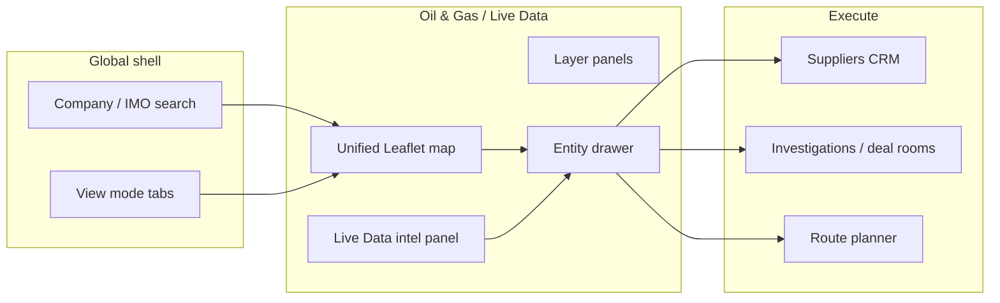
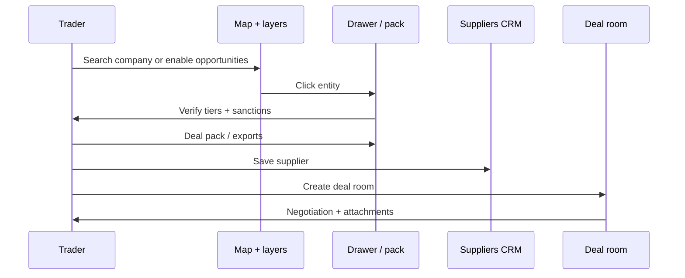

# UX spec — map layers, deal insights, trading workflow

| Field | Value |
|-------|-------|
| **Issue** | MAD-46 (parent [MAD-43](../MAD/issues/MAD-43)) |
| **Status** | Planning deliverable — **no implementation code** in this issue |
| **Branch** | `paperclip2` |
| **Date** | 2026-05-23 |
| **Related** | [ADR-0001](./adr/0001-oil-commodity-platform-architecture.md), [OPEN_DATA_MATRIX_MAD-45.md](./OPEN_DATA_MATRIX_MAD-45.md), [BOL_DATA_STRATEGY.md](./BOL_DATA_STRATEGY.md), [AGENTS.md](../AGENTS.md) |

## 1. North star

Meridian traders must **discover → verify → price → execute** oil and refined-product deals in under three minutes from a single map-first surface. The UX bar is ImportYeti-class company/shipment discovery; the data bar is honest tiers (`live`, `historic`, `macro`, `synthetic`, `inferred`, `user_upload`) with no paid-manifest masquerade.

**Non-goals for this spec:** ingest workers, new country adapters, Go migration — see MAD-45 / ADR child issues.

---

## 2. Personas & jobs-to-be-done

| Persona | Primary goal | Success in 90s | Secondary |
|---------|--------------|------------------|-----------|
| **Commodity trader** | Find a counterparty + route + price band for a deal | See vessel/cargo on map → open drawer → export deal pack or start deal room | Watch corridor; compare supplier vs buyer landed cost |
| **Trade analyst** | Research who loaded/discharge what, historic pattern | Company search → shipment list → macro validation | Export CSV; flag sanctions/LEI gaps |

Shared constraints: **map stays interactive** at Gulf hub zoom; drawer is depth, not default on every click; empty states explain tier and next action (graph-sync, zoom, toggle layer).

---

## 3. Information architecture (Intelligence Cockpit — implemented)

When `VITE_INTELLIGENCE_COCKPIT_ENABLED` is on (default), top navigation uses **5 modes**:

| Mode | Sublayers | Map behavior |
|------|-----------|--------------|
| **Global** | Countries, Licenses, Trade flows, Risk | Country-summary clusters; right **Intelligence rail** on country click |
| **Assets** | Mines, Oil fields, Refineries, Tank farms, Ports | Sector infrastructure + license markers |
| **Supply Chain** | Suppliers, Buyers, Deal packs | Broker workspace map canvas (replaces legacy Suppliers tab) |
| **Routes** | Vessels, Pipelines, Hubs | Route planner + maritime layer (collapsed **Layer drawer** default) |
| **Investigations** | — | Existing investigations panel |

**Rollback:** `VITE_INTELLIGENCE_COCKPIT_ENABLED=false` restores legacy Global / Mining / Oil & Gas / Ports / Route / Investigations tabs.

---

## 3b. Information architecture (legacy tabs → surfaces)



| Surface | Route / mode | Owns |
|---------|--------------|------|
| **Unified map** | `oil_and_gas`, `global` (maritime), Live Data overlay | Spatial truth, layer toggles, fly-to |
| **Live Data intel panel** | Live Data section (right rail) | Feed, opportunities list, cargo search, alerts |
| **Entity drawer** | Slide-over on map click / list click | Vessel, terminal, company, cargo, opportunity |
| **Suppliers** | `suppliers` view | Pipeline CRM, save-from-drawer |
| **Deal rooms** | `investigations` → deal rooms | Negotiation thread per entity |
| **Route planner** | `route_planner` | Supplier/buyer hub pick on map |

---

## 4. Primary flows (markdown wireframes)

### 4.1 Trader — “Find who’s moving product near my terminal”

```
[Live Data tab]
  → Map loads hub (Persian Gulf default bbox) — vessels OFF by default
  → User opens "Live Data map layers" panel
  → Enables: Terminals ✓, Vessels ✓, Corridors ✓
  → Pans/zooms; in-view counts update (terminals · tankers · corridors)
  → Clicks vessel chevron on map
  → Drawer opens (Overview): IMO, flag, last port call, tier badge
  → Tabs: Overview | MCR (if cargo linked) | Imports/Exports (if company)
  → "Open route planner" prefills supplier/buyer hints
  → "Create deal room" (if licensed)
```

**Rules:** No full 22k maritime canvas on Live Data tab entry (`allMaritime` opt-in only). Drawer opens on **explicit** entity click, not hover.

### 4.2 Trader — “Evaluate a deal hypothesis”

```
[Live Data intel panel → Opportunities tab]
  OR map layer "Opportunities" enabled
  → List sorted by confidence (≥0.55 default)
  → Click row OR map sparkle marker
  → Drawer default tab: Deal Execution Pack
  → Pack shows: parties (shipper/consignee), route arc, volume band,
     sanctions chip, LEI chip, benchmark strip, landed-cost proxy
  → CTAs: Watch | Save supplier | Route planner | Deal room | Export
```

**Copy rule:** Headline uses “Hypothesis” / “Signal”, never “Confirmed deal”. Confidence shown as % with tier legend link.

### 4.3 Analyst — “Who imported diesel to US Gulf?”

```
[Global search → company name]
  → Fly map to company terminal / last known activity
  → Drawer: Imports & Exports tab (default for company)
  → Table: historic (EIA) + synthetic (MCR) rows, tier column
  → "Highlight on map" filters Trade Flow layer to company_pair
  → Optional: Macro Trade Flows layer for country_pair validation
  → Export CSV from intel panel (opportunities / cargo tabs)
```

**Hard rule (from MAD-45):** Comtrade/Census rows appear only in macro layer or evidence footnotes — not as company-level BOL in search results.

### 4.4 Analyst — “Historic transaction trail”

```
[Layer: Historic — EIA arcs]  (Oil/Gas or Live Data historic group)
  → Arc popup: importer, origin country, product, volume, year, tier=historic
  → Click importer name → company drawer → Imports/Exports
[Layer: Macro Trade Flows]
  → Toggle company_pair vs country_pair in layer panel
  → Max 80 arcs in view (aggregated)
```

### 4.5 Execute — “Close the loop”

```
Drawer or opportunity pack
  → "Save to suppliers" → suppliers pipeline (Active count in tab bar)
  → "Create deal room" → investigations/deal_rooms, highlighted room
  → Route planner ← hints from cargo (ports, commodity family)
```

---

## 5. Unified map layer catalog

Layers are grouped in **two panels** today; spec consolidates mental model into **five groups** (implementation: MAD-4x-e merges UI).

### 5.1 Layer groups & defaults

| Group | Layer ID | Label (EN) | Default | Min zoom | Tier(s) | API / source |
|-------|----------|--------------|---------|----------|---------|--------------|
| **Live movement** | `vessels` | Oil/tanker AIS near terminals | **Off** (Live Data entry) | z≥5 | `live` | `GET /api/oil-live/map` bbox |
| | `coverage` | AIS coverage gaps | Off | z≥4 | `inferred` | coverage cells |
| | `all_maritime` | Global maritime canvas | Off | z≥3 | `live` | `oil-live-intel-worker` → Postgres (`oil_ais_positions`) |
| **Live trade** | `terminals` | Terminals & storage hubs | **On** (Live Data) | z≥5 | `inferred`/`live` | oil terminals bbox |
| | `corridors` | Shipment routes (MCR) | Off | z≥6 | `synthetic` | cargo records in view |
| | `opportunities` | Deal hypotheses | Off | z≥6 | `synthetic` | opportunities bbox |
| **Historic** | `eia_historic` | US import arcs (EIA) | Off | z≥4 | `historic` | EIA historic API |
| **Macro** | `trade_flows` | Trade flow arcs | Off | z≥4 | `macro` | `company_pair` / `country_pair` |
| | `macro_comtrade` | (future) corridor heat | Off | z≥3 | `macro` | aggregates table |
| **Infrastructure** | `osm_pipelines` | Pipelines (OSM) | Off | **z≥9** | `inferred` | Overpass bbox |
| | `osm_refineries` | Refineries | Off | z≥7 | `inferred` | OSM |
| | `osm_storage` | Tank storage | Off | z≥9 | `inferred` | storage farms layer |
| | `mapbox_oilmap` | Mapbox oilmap (optional) | Off | z≥6 | `inferred` | only if token + not disabled |
| **Mining** | `licenses` | License polygons | Contextual | cluster | varies | existing mining layers |

**License / petroleum static layers** (refineries as entities, oil fields) remain on Oil/Gas tab; do not duplicate in Live Data panel.

### 5.2 Layer panel UX (target)

```
┌─ Map layers ─────────────────────────────┐
│ ◉ Live Data    ○ Historic   ○ Macro      │
│ ○ Infrastructure (disabled until z≥9)     │
├──────────────────────────────────────────┤
│ [x] Terminals          (142 in view)      │
│ [ ] Vessels            (cap 500 bbox)     │
│ [ ] Corridors (MCR)    (max 200 arrows)   │
│ [ ] Opportunities      (max 40 markers)   │
│ [ ] Trade flows  [company_pair ▼]        │
│ [ ] AIS coverage                          │
│ ⚠ Enable vessels only if map feels slow   │
└──────────────────────────────────────────┘
```

- **Progressive disclosure:** Infrastructure subgroup collapsed until zoom ≥ 9; show inline hint “Zoom in to enable pipelines”.
- **In-view counts** beside toggles (already on Live Data panel).
- **Persist** layer toggles per user in `localStorage` keys scoped by tab (`liveData.layers.v1`).

### 5.3 Click behavior & drawer routing

| Map feature | Click | Drawer kind | Default tab |
|-------------|-------|-------------|---------------|
| Vessel | single | `vessel` | Overview |
| Terminal | single | `terminal` | Imports/Exports |
| Opportunity marker | single | `opportunity` | Deal pack |
| MCR corridor | single | `cargo` | MCR |
| Trade flow arc | single | popup → “Open company” | company |
| License polygon | single | license dossier | existing mining |
| Cluster | zoom in | — | no drawer until leaf |

**Performance:** Debounce bbox fetches **300ms**; use `keepPreviousData` for map overlays; WebSocket patch positions in place (no layer remount per tick).

---

## 6. Performance budget

Budgets apply to **median laptop, Gulf hub viewport, 50 Mbps**. Violations block release of MAD-4x-e.

| Metric | Budget | Current anchor (code) |
|--------|--------|------------------------|
| Live Data tab **first interactive map** | ≤ 2.5s | lazy hub layers; no 22k maritime default |
| Bbox API round-trip (p95) | ≤ 400ms | Go `oil-live-intel` + limit clamps |
| Pan/zoom repaint (p95) | ≤ 50ms | canvas vessel LOD, not cluster remount |
| Max vessels drawn (canvas LOD) | 4,500 | `LOD_MAX_DRAW` |
| Max vessels fetched (oil-live bbox) | 500 | API clamp |
| Max MCR arrows on map | 200 | `MAX_PER_MCR_ARROWS` |
| Max trade-flow arrows | 80 | `MAX_TRADE_FLOW_ARROWS` |
| Max opportunity markers | 40 | dedupe in `dedupeOpportunities` |
| Terminal cluster threshold | zoom &lt; 10 | `MarkerClusterGroup` |
| Infrastructure pipelines | only z≥9 | ADR + AGENTS.md |
| Drawer open (data ready) | ≤ 600ms | React Query staleTime 30s |
| WS position update | patch in place | `connectOilLiveWebSocket` |

**Regression checklist (manual):**

1. Live Data tab: map interactive with only terminals on.
2. Enable vessels + corridors at Gulf z=7: FPS stays usable; count shows cap message if `cap_applied`.
3. Toggle all infra at z=6: pipelines stay disabled with hint.
4. Rapid pan 10×: no duplicate polylines; prior request aborted.
5. Open 5 drawers sequentially: no memory climb &gt; 50MB on Chrome perf overlay.

---

## 7. Deal insight card patterns

### 7.1 Opportunity card (list + map popup)

Used in: `LiveDataIntelPanel` opportunities tab, map opportunity popup.

```
┌─────────────────────────────────────────┐
│ [Synthetic]  Confidence 72%        ⋮    │
│ Diesel · US Gulf → Rotterdam            │
│ SupplierCo → BuyerCo                    │
│ Vol ~80–120 kbbl · ETA window 14d       │
│ [Sanctions: clear] [LEI 5493…]          │
│ Why: corridor overlap + port call match │
│ [Open pack] [Watch] [Map]               │
└─────────────────────────────────────────┘
```

| Field | Required | Notes |
|-------|----------|-------|
| Tier badge | Yes | `OilLiveProvenanceBadge` |
| Confidence | Yes | Bar + %; threshold 0.55 list filter |
| Commodity family | Yes | Color from `commodityColor()` |
| Route shorthand | Yes | Origin hub → dest hub |
| Parties | Yes | Link to company drawer; show “unresolved” if null |
| Volume band | Yes | low–high or best estimate |
| Signal rationale | Yes | 1-line from `signal_json` / opportunity_type |
| Sanctions / LEI | Yes | chips from Deal pack rules |
| CTAs | Yes | Open pack, Watch, Highlight on map |

**Do not:** “AI verified”, “Guaranteed savings”, or single-point price without benchmark source.

### 7.2 Deal Execution Pack (drawer tab)

Sections (order fixed):

1. **Header** — title, confidence, tier, watch/save CTAs  
2. **Parties** — shipper, consignee, operator; each row: name, country, sanctions, LEI, link to dossier  
3. **Route & timing** — arc summary, port calls, ETA band  
4. **Volume & product** — HS family, specs note if missing  
5. **Economics** — benchmark strip (EIA/public), landed-cost **proxy** labeled inferred  
6. **Evidence** — collapsible MCR recipe lines + `source_record_url` links  
7. **Actions** — Route planner, Deal room, Export MD/PDF (MAD-4x-i)

### 7.3 Supplier↔buyer recommendation strip (new — MAD-4x-g/h)

When scorer finds complementary corridors:

```
┌─────────────────────────────────────────┐
│ Match signal · Synthetic                  │
│ Supplier A (UAE storage) ↔ Buyer B (EU)   │
│ Benefits:                                 │
│  • Est. freight −$1.2/bbl vs median route │
│  • Delivery −4d vs last 3 cargoes         │
│ Compare [3 similar corridors]             │
│ [Open both on map] [Start deal room]      │
└─────────────────────────────────────────┘
```

| Benefit type | Allowed copy | Data basis |
|--------------|--------------|------------|
| Cost reduction | “Est.” / “proxy” | corridor aggregate, public freight benchmarks |
| Faster delivery | “vs last N cargoes” | port-call timestamps, same pair |
| Similar supplier | “Same HS family, same origin hub” | MCR clustering |

---

## 8. Trading workflow (end-to-end)



| Step | UI | Data tier gate |
|------|-----|----------------|
| Discover | Map + intel search | Show all; badge tier |
| Verify | Drawer evidence tab | Require `source_record_url` or recipe id |
| Price | Deal pack economics | Benchmarks only; proxies labeled |
| Execute | Suppliers + deal room | User/auth license |

**Empty states:**

| State | Message | Action |
|-------|---------|--------|
| No opportunities | “No hypotheses above 55% in this view” | Widen map or run graph-sync |
| No corridors | “Zoom to hub or enable MCR ingest” | Fly Gulf / sync-status link |
| No historic rows | “No EIA imports for this company” | Try macro layer |
| Sanctions unknown | “Unscreened — run enrichment” | link to admin graph-sync |

---

## 9. Component mapping (implementation reference)

| Spec area | Existing component | Gap |
|-----------|-------------------|-----|
| Live layer panel | `LiveDataMapLayersPanel.tsx` | Merge infra + historic/macro groups (4x-e) |
| Infrastructure | `InfrastructureLayersPanel.tsx` | z≥9 gate + persist |
| Map overlays | `OilLiveMapOverlays.tsx` | Enforce caps in UI feedback |
| Drawer | `OilLiveEntityDrawer.tsx` | Vessel port calls tab (4x-d) |
| Deal pack | `DealExecutionPack.tsx` | PDF export (4x-i) |
| Opportunities | `LiveDataIntelPanel.tsx` | Match recommendation strip (4x-h) |
| Vessel LOD | `vesselDisplayLod.ts` | Documented in §6 |
| Workflow helpers | `liveDataWorkflow.ts` | Extend save/watch |

---

## 10. Accessibility & i18n

- All layer labels: Hebrew + English via `useI18n` (existing pattern).
- Tier badges: icon + text, not color-only.
- Drawer: focus trap, Esc closes, map pan still keyboard-accessible.
- Opportunity confidence: expose as text for screen readers (`aria-label`).

---

## 11. Implementation child issues (after CEO approval)

Create only after `request_confirmation` accepted. Owner defaults from ADR-0001.

| ID | Title | Owner | Depends on |
|----|-------|-------|------------|
| MAD-4x-d | Vessel drawer: port calls + MCR parties + tier badges | Cursor Engineer | MAD-46 approved |
| MAD-4x-e | Unified layer panel: Live / Historic / Macro / Infra | Cursor Engineer | MAD-46 approved |
| MAD-4x-f | Company search → fly map → drawer shipment list | Cursor Engineer | MAD-46 approved |
| MAD-4x-g | `deal_opportunity_signals` schema + batch scorer | OpenRouter Engineer | MAD-45 matrix |
| MAD-4x-h | Opportunities layer + match insight cards | Cursor Engineer | MAD-4x-g |
| MAD-4x-i | Deal pack v2 export (PDF/MD) | Cursor Engineer | MAD-4x-d |

---

## 12. Verification (planning issue)

```bash
# Confirm spec exists (no product code in MAD-46)
test -f docs/UX_SPEC_MAD-46.md

# Cross-check layer caps referenced in code
rg -n "MAX_PER_MCR_ARROWS|MAX_TRADE_FLOW_ARROWS|LOD_MAX_DRAW" mining-viz/src

# Cross-check drawer + pack wiring
rg -n "OilLiveEntityDrawer|DealExecutionPack|LiveDataMapLayersPanel" mining-viz/src
```

**Acceptance mapping (MAD-46):**

- [x] Wireframes / markdown flows — §4 (trader + analyst)
- [x] Map layer list + performance budget — §5–§6
- [x] Insight card patterns — §7

---

*Planning only. Operational data inventory: [OPEN_DATA_MATRIX_MAD-45.md](./OPEN_DATA_MATRIX_MAD-45.md). Architecture: [ADR-0001](./adr/0001-oil-commodity-platform-architecture.md).*
