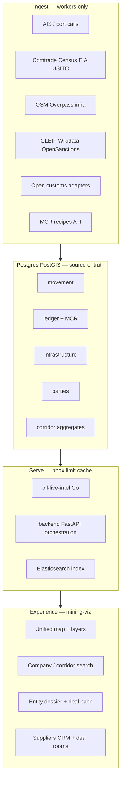
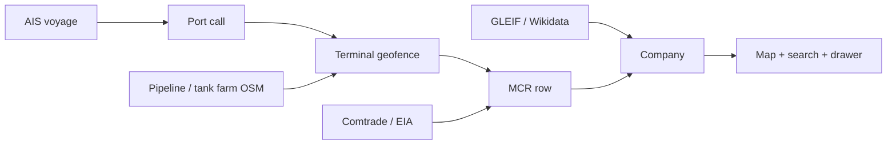

# ADR-0001: Oil & commodity platform architecture

| Field | Value |
|-------|-------|
| **Status** | Accepted (MAD-44, 2026-05-23) |
| **Date** | 2026-05-23 |
| **Parent** | [MAD-43](https://paperclip) — make the system great |
| **Branch** | `paperclip2` |
| **Supersedes** | Ad-hoc architecture notes; see [MERIDIAN_PLATFORM_ARCHITECTURE.md](../MERIDIAN_PLATFORM_ARCHITECTURE.md) for living ops detail |

## Context

Meridian (MadSan Global Intelligence) must let traders **discover → verify → price → execute** oil and refined-product deals (crude, condensate, diesel, gasoil, jet, gasoline, naphtha, fuel oil/VLSFO, LPG, LNG, heavy crude) using the **widest legal free-data spine**, with ImportYeti-class UX and honest tier labels.

Constraints from product and engineering:

- **No paid-manifest scraping** (ImportYeti, CBP, Panjiva, broker UIs).
- **Performance is critical** — millions of rows in Postgres; the browser must stay fast.
- **Map-first** — stored trade, movement, and infrastructure must appear on the unified map (bbox-limited).
- **Strangler to Go** — expand `oil-live-intel` for hot read paths; keep Python for ingest orchestration.
- **No big-bang rewrite** — phased vertical slices (ingest → Postgres → map layer → drawer).

Related planning siblings under MAD-43: **MAD-45** (open-data matrix), **MAD-46** (UX spec).

## Decision

Adopt a **four-plane architecture** with explicit service boundaries, data tiers, and incremental delivery.

### 1. Four planes

| Plane | Owns | Must not |
|-------|------|----------|
| **Ingest** | Scheduled workers, graph-sync, idempotent upserts, sync run logs | Block HTTP; return unbounded rows |
| **Store** | All attributable trade/movement/infra/party facts | Serve as cache-of-record |
| **Serve** | Bbox/limit APIs, corridor aggregates, search, MCR rebuild | Duplicate business rules in frontend |
| **Experience** | React map, debounced fetches, tier badges, drawers | Full-table fetch; drawer on every map click |

### 2. Product pillars (discover → execute)

| Pillar | User outcome | Primary storage / APIs |
|--------|--------------|------------------------|
| **Discover** | Who ships what where; corridors; terminals | `oil_ais_positions`, `oil_port_calls`, `meridian_cargo_records`, `oil_trade_flows`, map bbox |
| **Verify** | Provenance, sanctions signal, macro validation | MCR `evidence_chain`, OpenSanctions, GLEIF, `source_record_url` |
| **Price** | Benchmarks, route economics, deal pack | Deal Execution Pack, public benchmarks (EIA/JODI roadmap) |
| **Execute** | Suppliers, deal rooms, exports | Suppliers CRM, deal rooms, RFQ-lite (Phase 3) |

### 3. Data tiers (honest labeling — non-negotiable)

Every row exposed to traders carries:

| Tier | Meaning | Examples |
|------|---------|----------|
| `live` | Fresh movement / triangulation | AIS, port calls, live MCR |
| `historic` | Government historic manifest-like | `eia_historic_imports`, open customs |
| `macro` | Country–country / HS aggregates | Comtrade, Census, USITC |
| `synthetic` | MCR hypothesis | Recipes A–I on public signals |
| `inferred` | Geo/heuristic proxy | OSM storage count → capacity proxy |
| `user_upload` | Consented user CSV | BOL upload |

Production: `OIL_LIVE_DISABLE_DEMO_SEED=1`, `exclude_demo` on list APIs. MCR ≠ customs manifest — always labeled.

### 4. Service boundaries (strangler pattern)

| Component | Responsibility | Language |
|-----------|----------------|----------|
| `mining-viz` | Thin client; React Query; map layers; virtualized lists | TypeScript |
| `backend` | Auth, licenses, graph-sync orchestration, ingest jobs, admin | Python |
| `oil-live-intel` | Map features, cargo search, MCR engine, corridor aggregates, ES indexer | Go (expand) |
| `oil-live-intel-worker` + graph-sync workers | AIS ingest (Go), batch graph-sync (Python orchestrator + optional Go steps) | Go / Python |
| Redis | Hot cache (live AIS durable in Postgres via `oil-live-intel-worker`) | — |
| Elasticsearch | Search index only; Postgres is truth | — |

**Go migration candidates** (profile before moving):

- `GET /api/oil-live/map` (bbox features)
- Company shipment lists / cargo search
- `mcr_corridor_aggregates` read path
- MCR rebuild hot loops

**Stay in Python:** long graph-sync orchestration, new country adapters (until proven hot), admin tooling.

### 5. Read-path rules

| Rule | Implementation |
|------|----------------|
| Bulk in DB, sparse on wire | Workers ingest; API returns `bbox` + `limit` |
| Map debounce | 450ms pan; `keepPreviousData` |
| Low-zoom corridors | `mcr_corridor_aggregates`, not raw MCR legs |
| Infrastructure default | Off at world zoom; on at z ≥ 9 or explicit toggle |
| Drawer isolation | No refetch drawer lists on every pan |
| Marker caps | 500–2000 per bbox (match existing APIs); cluster beyond |

### 6. Cross-matching engine (“ImportYeti without paying”)

| Recipe | Signals | Products |
|--------|---------|----------|
| A–F | AIS + macro + parties | Crude, clean products |
| G | EIA refinery PADD | Diesel / gasoil hubs |
| H (new) | Storage OSM + port throughput | Tank farm ↔ vessel |
| I (new) | Pipeline endpoint + terminal | Landed-cost corridors |

### 7. Performance SLOs (p95 targets)

Measured on production-like VM (`docker-compose.prod.yml`), default hub bbox (e.g. US Gulf), WiFi, Chrome:

| Surface | Metric | p95 target | Notes |
|---------|--------|------------|-------|
| Live Data tab — first paint | Time to interactive map + default layer | **≤ 2.0s** | Terminals + one overlay |
| Map bbox refetch | `GET /api/oil-live/map?bbox=&limit=` | **≤ 800ms** | After 450ms debounce |
| Company search (ES up) | `LiveDataSearchBar` → first results | **≤ 500ms** | 300ms input debounce + API |
| Company search (ES down) | Degraded PG fallback | **≤ 1.5s** | Show honest banner |
| Entity drawer — open | Shipment list first page | **≤ 1.2s** | Paginated; no map refetch |
| Corridor layer (low zoom) | Aggregated trade-flow render | **≤ 1.0s** | No per-row arcs at world zoom |
| AIS WebSocket tick | Position update without layer remount | **≤ 100ms** client processing | Cap updates/sec per vessel |
| Graph-sync status | `sync-status` endpoint | **≤ 300ms** | For health chip |
| Infrastructure toggle (z≥9) | Pipelines + storage bbox load | **≤ 1.5s** | Simplified geometry |

**Guardrails:** No API response > 2 MB JSON; no `limit` > 2000 on map endpoints without explicit admin flag; CI bundle budget check in Phase 3.

### 8. Phased roadmap (no big-bang)

#### Phase 0 — Fleet stable (now)

- Paperclip agents runnable; `paperclip2` branch discipline.
- CEO recovery + adapter fix script documented.

#### Phase 1 — Trader-visible ledger (8–12 weeks)

Vertical slices only — each: **ingest → Postgres → map layer → drawer**.

| Slice | Outcome |
|-------|---------|
| Vessel → port call → MCR on map | “Who loaded this vessel” |
| EIA historic + macro same map | Historic context |
| Company search → drawer shipments | ImportYeti-shaped |
| Infrastructure OSM (pipes + storage) | Tank farms / pipelines |
| `sync-status` honest counts | Trust |

#### Phase 2 — Deal intelligence (12–20 weeks)

| Slice | Outcome |
|-------|---------|
| Supplier–buyer opportunity scorer | Cost / time insights |
| HS2710 product filters | Diesel, gasoil, VLSFO, gasoline |
| Open customs adapter #1 | Real manifest-like rows (EU/UK/BR/IN) |
| Deal pack v2 | Trader export |

#### Phase 3 — Scale & polish (20+ weeks)

More customs countries; Eurostat + JODI validation; RFQ-lite; UI perf budget in CI.

## Consequences

### Positive

- Clear ownership per plane; engineers can ship vertical slices without rewrite risk.
- Honest tiers preserve trust and legal defensibility.
- Go strangler improves map/search latency under data growth.

### Negative / risks

- Dual-language business logic until Go paths are proven — require contract tests on shared DTOs.
- MCR volume without aggregates will break map perf — corridor table is mandatory before scale.
- Open customs vary by country — adapter work is sequential, not parallel-safe without schema discipline.

### Compliance

- No scraping paid BOL vendors.
- Sanctions = signal chip, not auto-block (unless policy changes).

## Recommended implementation child issues

Create **after CEO approves this ADR** (max 3 per wake). Each issue: one vertical slice, `paperclip2`, acceptance = ingest + map + drawer proof.

### Ingest lane (OpenRouter Engineer or graph-sync owner)

| Proposed ID | Title | Scope |
|-------------|-------|-------|
| MAD-4x-a | Port-call → MCR linkage worker | Geofence refresh; Recipe A–F on new port calls; `sync-status` counts |
| MAD-4x-b | Infrastructure ingest (OSM storage + pipelines) | Upsert `petroleum_osm_features`; `terminal_type=storage`; national GIS gap doc |
| MAD-4x-c | Open customs adapter #1 (country TBD in MAD-45) | Manifest-like rows; `bol_tier=historic`; DATA_SOURCES row |

### Map / UI lane (Cursor Engineer)

| Proposed ID | Title | Scope |
|-------------|-------|-------|
| MAD-4x-d | Vessel drawer: port calls + MCR parties + tier badges | Highest demo value; no drawer-on-click storm |
| MAD-4x-e | Unified layer panel: Historic / Live / Macro / Infra | Defaults per ADR; z≥9 infra |
| MAD-4x-f | Company search → fly map → drawer shipment list | ES + degraded PG; 300ms debounce |

### Deal-matching lane (backend + UI)

| Proposed ID | Title | Scope |
|-------------|-------|-------|
| MAD-4x-g | `deal_opportunity_signals` schema + batch scorer | Corridor overlap, landed-cost proxy, LEI/sanctions; `signal_json` provenance |
| MAD-4x-h | Opportunities map layer + drawer panel | Hypothesis scores only — no “AI confirmed deal” |
| MAD-4x-i | Deal pack v2 export (PDF/MD) | Parties, route, benchmarks, tier legend |

**Dependencies:** MAD-45 (data matrix) informs MAD-4x-c country pick; MAD-46 (UX spec) informs MAD-4x-d/e layout.

## References

- [AGENTS.md](../../AGENTS.md) — north star, performance golden rules
- [MERIDIAN_PLATFORM_ARCHITECTURE.md](../MERIDIAN_PLATFORM_ARCHITECTURE.md) — operational architecture
- [DATA_SOURCES.md](../DATA_SOURCES.md), [LIVE_DATA.md](../LIVE_DATA.md), [BOL_DATA_STRATEGY.md](../BOL_DATA_STRATEGY.md)
- Code: `oil-live-intel/`, `backend/services/oil_live_graph_sync.py`, `mining-viz/src/features/live-data/`
