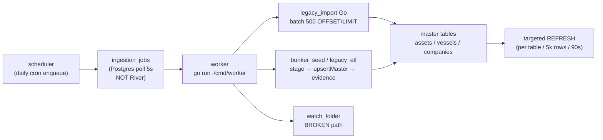

# MadSan V2 — Roadmap Status (2026-06-10, build batch 1+2 in flight)

North star: **discover → verify → price → execute** (honest tiers, evidence chains, map-first UX).

## Plan phase completion (effective)

Based on prior commits on `new-refactor-eng-style` (not plan file edits):

| Phase | Status | Evidence |
|-------|--------|----------|
| **0** Reports + scaffold | **COMPLETE** | `agent_reports/`, `madsan/` tree, dev bootstrap |
| **1** Schema + matviews | **COMPLETE** | 23 migrations; serving matviews + GIST/filter indexes (`023`); throttled per-table refresh during legacy import |
| **5b** Entitlements (`phase5b-entitlements-ff`) | **COMPLETE** | `internal/entitlements` resolver `Can`+`Resolve`; `/api/core/auth/me` returns `entitlements`+`plan`; middleware on deals/supplier search/portal/admin/premium pipeline MVT; migration `023` pro/enterprise+`supplier_portal`/`deal_watch`; UI gating via `lib/entitlements.ts`; billing/Stripe deferred |
| **6** Map + MVT | **COMPLETE** | ST_AsMVT tiles, pipeline lines, vessel chevrons, hover tooltip + selected glow, pipeline dossier lookup (`be4a5fba`, `74eeab55`, phase6 close) |
| **9** Deal verification (`phase9-deal-verification-pack`) | **COMPLETE** | S19 E2E: commodity/qty/location/seller/buyer/incoterm/docs/price/asset+vessel → DD rules, OpenSanctions, location asset match, buyer+seller registry, pack v1.1 (json/md/html) + relationship graph; energy EN590/VLSFO/crude/jet/fuel-oil doc+benchmark tiers; metals doc routing; RBAC on verify/pack/watch; deals UI full result panels + cookie-auth pack download |

**Partial (shipped slices; batch agents may close gaps):**

| Phase | Status | Shipped | Remaining gap |
|-------|--------|---------|---------------|
| 2–3 Ingestion + worker | **PARTIAL** | Targeted matview refresh (`71fc3701`); RawDataDir fix (`9a84ec7f`); import report + dry-run + dedup auto-enqueue (`ef359e38`) | 16-step pipeline, River queue, watch_folder worker restart |
| 4 Legacy ETL | **PARTIAL** | Go-default import; licenses + vessels parity green (`bcb0f2a`) | `petroleum_osm_features` import ~47% → 100%; `legacy-parity` exit 0 |
| 5 Go core + auth | **PARTIAL** | JWT + httpOnly cookie cutover (`a68eb37d`) | S21 entity envelope (batch 1) |
| 6b Realtime WS | **PARTIAL** | Dead-reckoning (`d80d3fe3`) | MessagePack frames (batch 1); alert job queue |
| 7 Energy UI | **PARTIAL** | Status bar + ticker trends (`3c64a846`) | Gulf AIS disclaimer (batch 1); real VLSFO feed |
| 8 Supplier discovery | **PARTIAL** | Ranked geo+commodity search (`62015b65`) | Activity/risk fusion (batch 1) |
| 8b Intelligence signals | **PARTIAL** | Signal history, corridors | 6-factor STS model (batch 1) |
| 9b Deal monitoring | **PARTIAL** | Watch toggle + changes panel (`e99d9d62`); alert diff scaffold (`465e1f81`) | Scheduled watch worker, map-pinned living packs |
| 10 Portal + admin | **PARTIAL** | Portal scaffold (`03ccc97c`); dedup merge UI (`099e7850`) | Data-quality dashboard (batch 1); review promotion |
| 11 Metals vertical | **PARTIAL** | Layer registry (`5be9729e`); metals deal verify + doc routing (phase 9) | Smelters/cadastre data; full metals pack parity vs energy |
| 12c Legal | **PARTIAL** | Legal page + dispute/GDPR APIs (`8ff57533`, `696cc53d`) | External counsel sign-off; commercial_use_ok gate (batch 1) |
| 12d Security/RLS | **PARTIAL** | `014_rls_scaffold`; GUC middleware stub (`9bbce7c8`) | Audit log + role cutover (batch 1) |
| 12e Notifications | **PARTIAL** | Onboarding (`9269409f`); feedback flywheel (`100e4844`) | Email notification scaffold (batch 1) |
| 13 Perf + deploy | **PARTIAL** | Prod overlay (`bc050552`); launch checklist ops (`8978bb7c`); k6 smoke (`48daef66`) | TLS, backup cron, observability endpoint (batch 1) |

**Not started / deferred:** 8c–8f (pgRouting, MCR, predictive, leads — batch 2 scaffolds), 12b satellite intel (batch 2 defer doc), 14 Trust Score (batch 2 scaffold), River queue, Splink runtime, billing.

## Build in progress (2026-06-10)

**12 parallel agents** on `new-refactor-eng-style`. Petroleum import worker (`53774b3f`) **untouched** — do not restart mid-job.

### Batch 1 (in flight)

| Agent | Plan phases | Scope |
|-------|-------------|-------|
| Phase 2-3 ingestion gaps | 2–3 | ~~Import result JSON, dry-run, post-import dedup auto-enqueue~~ **landed** (`ef359e38`) |
| Phase 5 entity response shape | 5 | S21 EntityEnvelope on core entity GETs; authFetch on remaining pages |
| Phase 6b-7-12 map UX | 6b, 7, 12 | MessagePack WS + JSON fallback; Gulf/Hormuz coverage banners |
| Phase 8 supplier fusion search | 8 | Commodity/country/geo fusion on supplier search + UI presets |
| Phase 8b STS scoring | 8b | 6-factor STS model in Go; dossier signal history |
| Phase 9b-10-11 deals admin | 9b, 10, 11 | Deal watch worker + `deal_change_events`; data-quality admin; metals pack parity |
| Phase 12c-12d-12e-13 ops | 12c–12e, 13 | Audit log, email stub, observability endpoint, backup cron example |

### Batch 2 (just launched)

| Agent | Plan phases | Scope |
|-------|-------------|-------|
| Phase 4 ETL dd_rules port | 4 | Go `dd_rules.json` loader; `wait_legacy_import.sh`; storage reconcile report |
| Phase 8c pipeline graph API | 8c | Pipeline connectivity from `pipeline_graph_edges` |
| Phase 8d-8e-8f intel stubs | 8d–8f | MCR/predictive/leads scaffolds (honest not_implemented tiers) |
| Phase 12b-14 deferred stubs | 12b, 14 | Satellite defer doc; Trust Score scaffold API |
| Mark shipped phases complete | — | This roadmap update (agent_reports only) |

**Critical path after batches land:** `legacy_import` job completes → `go run ./cmd/legacy-parity` exit 0 → worker restart (targeted matview `71fc3701`, watch_folder `9a84ec7f`) → prod volume seed + TLS checklist.

## On-track assessment

| Pillar | Target | Status | Evidence |
|--------|--------|--------|----------|
| Discover | Global search, map layers, suppliers | **On track** | ⌘K search, energy/metals MVT, pipeline lines + vessel chevrons, live AIS overlay, 76k assets |
| Verify | Dossiers, deals, sanctions, packs | **On track** | Entity dossier + evidence, DD rules, OpenSanctions, pack v1.1 + relationship graph |
| Price | Signals, opportunity score, freshness | **Partial** | EIA daily crude spot when keyed; VLSFO/Gold ticker stub row shipped (`9473721e`) |
| Execute | Portal, billing, compliance gates | **Partial** | Supplier portal scaffold shipped (`03ccc97c`); no billing/KYC cutover |

**Verdict:** MVP intelligence loop (discover → verify) is **shippable for internal DD**. Price feeds and execute path remain Phase 10+.

## Live data (madsan_db :5433)

| Table | Rows | Notes |
|-------|------|-------|
| companies | ~18.7k | Includes operator stubs from OSM backfill |
| assets | ~76k | Energy OSM + license cadastre |
| vessels | ~9.6k | Live AIS sync from legacy |
| evidence | ~227k | Provenance claims |
| relationships | ~16k | Company↔asset + vessel↔terminal |
| core_signals | ~18k | AIS + import snapshots |

## Phase completion

### Done (greenfield `madsan/`)

- Schema + migrations, Go API :8088, JWT auth, entitlements scaffold
- Ingestion: bunker seed, watch folder, Postgres job queue, worker/scheduler
- Legacy bridge: Go-native import (default), Python fallback
- Map: MapLibre terminal, vector tiles, WS live vessels, corridor lines
- **Map UX fixes:** pipeline LineString MVT + line layers (`be4a5fba`); vessel ship chevrons with heading rotation (`74eeab55`); legacy AIS heading backfill (`4f61f66b`); pipeline dossier OSM metadata (`3610abe`)
- Dossiers: company/asset/vessel, signals, signal history, relationships
- Deals: verify (S19 full field coverage), sanctions, pack export (json/md/html), relationship graph in pack; energy commodity benchmarks (VLSFO_SG for distillates/jet, Brent/WTI crude); metals missing-doc routing; authenticated pack download in UI
- Admin console, metals vertical, global search
- **Git:** `madsan/` committed on branch `new-refactor-eng-style` (~159 tracked files)
- **Admin health:** `/admin` runtime panel + `GET /api/admin/health/runtime` (AIS sync, legacy parity drift)
- **Metals fix:** petroleum OSM rows excluded from metals tiles/search/summary; vertical switch resets layers
- **EIA ticker:** WTI/Brent daily spot via EIA v2 when `EIA_API_KEY` set; honest stub tier otherwise
- **Splink prep:** SQL duplicate clusters → pairwise CSV export (`/api/admin/dedup/companies/pairs.csv`, CLI)
- **Pairwise dedup scoring:** `pair_score.go` — trigram + country agreement; tiers `high_confidence` / `manual_review` / `skip`; cluster list + CSV export include `match_score` + `review_tier` (`e934964`)
- **Cross-name dedup discovery:** `cross_name_pairs.go` + migration `013_companies_trgm_index` — pg_trgm similarity pairs across differing `normalized_name`
- **Entitlements (5b):** resolver merges plan → subscription → override → feature flag; `/api/core/auth/me` exposes per-feature map; gated routes: deals verify/pack/watch, `GET /api/energy/suppliers/search`, `POST /api/portal/*`, `/api/admin/*` (`api_access`), `GET /tiles/pipelines/*` (`map_premium_layers`); usage_events on verify/pack/watch/supplier search; frontend `fetchMe`+`canUse` on terminal/deals/portal/admin/data-quality
- **RLS scaffold (dev):** migration `014_rls_scaffold` applied on dev — `usage_events` RLS + `madsan_rls` deny stub; `app_current_tenant_id()` helper; API still connects as owner (no behavior change until role cutover)
- **Legacy import (Go default):** `legacy_import` jobs via `processLegacyImportGo`; daily scheduler enqueue; Python opt-in only (`MADSAN_LEGACY_PYTHON`)
- **Parity gate:** `cmd/legacy-parity` CLI (exit 0/1) + cached admin Runtime health panel; 5% threshold on critical tables (`oil_vessels`, `licenses`, `petroleum_osm_features`). **Licenses green** — dedup-key parity (45,506 expected keys, 0.01% drift; `bcb0f2a`, `1f745a6`). **Petroleum OSM fail** (~70.6% under-imported, 89.5k/303.7k as of 19:44Z) — **Go `legacy_import` job running** (~37 min elapsed); blocks Python retirement until exit 0

### Evening parallel UI batch (2026-06-09)

| Commit | Area | Shipped |
|--------|------|---------|
| `9269409f` | Onboarding (12e) | Guided onboarding flow, empty states, sample-deal path (<3 min to value) |
| `03ccc97c` | Supplier portal (10) | Portal scaffold — offers/assets/docs submission UI → `manual_review_queue` |
| `9473721e` | Energy UI (7) | VLSFO/Gold ticker stub row in market ticker (honest stub tier) |
| `62015b65` | Supplier discovery (8) | Ranked supplier queries with geo + commodity filters over `supplier_search` |
| `71fc3701` | Worker (3) | Targeted matview refresh per job type (not all views every job); **worker restart deferred** to pick up |

### UI gap closure batch (2026-06-09 late evening)

| Commit | Area | Shipped |
|--------|------|---------|
| `3c64a846` | Energy UI (7) | Bottom status bar, ticker trend bars, confidence-tier polish |
| `28b35bda` | Energy UI (7) | TickerTrendBar SVG title fix |
| `e99d9d62` | Deal monitoring (9b) | Deal watch toggle + changes panel wired to `/api/deals/{id}/watch` |
| `099e7850` | Admin dedup (10) | Human merge review enqueue workflow from scored pairs |
| `edcf40c1` | Admin dedup (10) | Admin page syntax restore after dedup merge edits |
| `d80d3fe3` | Realtime WS (6b) | Client-side vessel dead-reckoning on live WS overlay (60fps interpolation) |
| `5be9729e` | Metals UI (11) | Phase 11 metals vertical layer registry + UI parity |

**Remaining UI gaps (non-blocker, next batch):**

| Gap | Phase | Status | Fix | Notes |
|-----|-------|--------|-----|-------|
| Bottom status bar + ticker sparklines | 7 | **FIXED** | `3c64a846`, `28b35bda` | ENGINE.online-style status bar + trend bars shipped |
| Deal watch / changes panel | 9b | **FIXED** | `e99d9d62` | Watch toggle + changes panel; alert engine + map-pinned living packs still gap |
| Dedup merge / review enqueue UI | 10 | **FIXED** | `099e7850`, `edcf40c1` | Human merge from scored pairs → `manual_review_queue` |
| Client dead-reckoning | 6b | **FIXED** | `d80d3fe3` | 60fps interpolation on live overlay |
| Binary MessagePack WS frames | 6b | **GAP** | — | JSON WS only; conflation/backpressure spec deferred |
| Metals vertical UI layer registry | 11 | **FIXED** | `5be9729e` | Shell + layers shipped; smelters/cadastre data + deal-pack parity still gap |

### Partial

| Item | Gap | Next step |
|------|-----|-----------|
| 16-step ingestion pipeline | Jobs poll `ingestion_jobs`; no Splink/River | Dedup merge UI shipped (`099e7850`); Splink batch automation deferred |
| Python ETL | Fallback only | Licenses + vessels green; **petroleum_osm_features import** → retire `legacy_import.py` |
| Matviews | `map_energy_assets` may lag live tiles | Drop or refresh-on-ingest only |
| RBAC | Cookie auth MVP | Admin ✅ · Deals ✅ · portal/billing routes next |
| Price ticker | EIA crude when keyed | VLSFO/Gold stub row shipped (`9473721e`); real feed deferred |
| Supplier portal | Admin ✅ | Portal scaffold shipped (`03ccc97c`); review promotion + polish next |
| Onboarding | — | Guided flow shipped (`9269409f`); email/notifications deferred |
| Ranked search | Global search ✅ | Geo + commodity ranked queries shipped (`62015b65`); activity/risk fusion next |
| Matview refresh | All views every job | Targeted refresh shipped (`71fc3701`); worker restart deferred |
| Compose cutover | Prod overlay ready | Seed named volumes + Caddy deploy on ARM VM |
| Production launch | Checklist not run | Phase 14 — observability, backup cron, TLS |

### Not started (original plan)

- River job queue
- Splink entity resolution (automated merge from scored pairs)
- MCR v2, Comtrade ingest
- Billing, full observability stack
- Full supplier portal workflow (scaffold shipped `03ccc97c`; review promotion pending)

## Execution plan sync

Aligned with `madsan_v2_execution_log.md` and `madsan_v2_compose_rebuild_plan.md`:

| Phase | Item | Status |
|-------|------|--------|
| **3** | Scheduler + worker + job queue | **Partial** — targeted matview refresh (`71fc3701`); worker restart deferred |
| 10b | Dev compose (`compose_up.sh`) | Done |
| 10e | EIA open-data ticker | Done |
| 10f | Supplier portal scaffold | **Done** (`03ccc97c`) |
| 4d | Splink prep export | Done |
| **4d+** | Pairwise dedup scoring (clusters + CSV) | **Done** (`e934964`) |
| 11a | Admin runtime health | Done |
| **4e** | Legacy parity gate (CLI + admin panel) | **Partial** — licenses + vessels pass; petroleum OSM import pending |
| **RBAC / entitlements** | Deals, suppliers, portal, admin API, premium MVT + UI gates | **Done** (phase5b) |
| **12d** | RLS scaffold (`014_rls_scaffold`) | **Partial** — applied on dev; API role cutover deferred |
| **13** | Prod compose overlay (`docker-compose.prod.yml`) | **Done** — limits, reservations, healthchecks, `linux/arm64`, named volumes, Caddy :80, no dev bind mounts |
| **12e** | Onboarding + empty states | **Partial** — guided flow shipped (`9269409f`); email/notifications deferred |
| **8** | Ranked supplier search | **Partial** — geo + commodity filters (`62015b65`); activity/risk fusion next |
| **14** | Production launch checklist | **In progress** (observability, TLS, volume seed, backup) |

## Architecture alignment

| Mandate | Compliance |
|---------|------------|
| Go permanent backend | New APIs/workers in Go ✅ |
| Legacy Python transitional | AIS via Go; legacy read Go-default ✅ |
| Honest coverage disclaimers | Gulf AIS, inferred vessel-terminal links ✅ |
| Postgres + PostGIS source of truth | All intelligence in madsan_db ✅ |
| Map not tables-only | Pipeline lines, vessel chevrons, dossier click-through ✅ |

## Next priorities (ordered)

1. **4e** — Full Go **Legacy import (all)** for `petroleum_osm_features` (no `max_rows` cap); re-run `legacy-parity` until exit 0 — **blocker for Python retirement**
2. **14** — Production launch checklist (TLS on Caddy, volume seed for `/raw`/`/etl`, `backup_db.sh` cron, smoke test via Caddy :80)
3. **12d** — RLS role cutover (`madsan_rls` + `SET app.tenant_id`) after map/search tenant audit
4. **9b alert engine** — Living deal packs pinned on map; diff linked entities (price, vessel, sanctions) → deal card alerts

## Risks

- **API OOM (exit 137):** prod overlay caps API at 1536m; monitor AIS batch size via admin health
- **Duplicate companies:** 18.7k rows with ETL duplicates; search deduped, DB not merged until review queue actions
- **Inferred links:** vessel-terminal and operator links are intelligence hints, not facts
- **OpenSanctions:** screening is review-tier, not confirmation
- **Prod volumes:** `madsan_raw_data` / `madsan_etl_data` named volumes start empty — seed before legacy import jobs
- **Parity drift:** licenses + vessels pass; **petroleum_osm_features ~70% under-imported** blocks Python retirement — full Go Legacy import (all) must finish with worker up
- **Watch folder:** 2 failed jobs — bad `RawDataDir` when worker runs from `madsan/backend` (`…/backend/madsan/raw` missing); fix path or run worker from repo root / compose

## Known gaps (2026-06-09 audit vs plan)

Cross-check: plan `madsan_intelligence_v2_92fbee25`, `legacy-parity` CLI, `ingestion_jobs` table, evening batch doc `c2d6e244`, UI gap fixes `3c64a846`–`5be9729e`.

### Map UX gaps — audit vs shipped

| Gap | Status | Fix | Notes |
|-----|--------|-----|-------|
| Pipelines render as point dots | **FIXED** | `be4a5fba` | Legacy LineString MVT + frontend line layers (z≥4); import geom preserved (`a2549bfd`) |
| Vessels render as dots, no heading | **FIXED** | `74eeab55` | Ship symbol layers rotate on AIS course/heading; dim dot tier when no bearing |
| Sparse vessel heading in tiles/WS | **FIXED** | `4f61f66b` | `cmd/backfill-vessel-heading` copies legacy `oil_ais_positions`; MVT exposes course/heading (`d1401a8b`) |
| Pipeline click dossier thin | **FIXED** | `3610abe` | Asset summary shows geometry type, substance, OSM tags from `raw_payload` |

**Phase 6 map engine (S16/S17/S23) — closed 2026-06-10:**

| Requirement | Status | Notes |
|-------------|--------|-------|
| MapLibre dark shell | **DONE** | CARTO dark raster + terminal chrome |
| ST_AsMVT `/tiles/{layer}/{z}/{x}/{y}.mvt` | **DONE** | energy-assets, metals-assets, vessels, pipelines |
| Typed layer registry | **DONE** | `frontend/src/lib/layers.ts` — energy/metals/shared + premium gate |
| No DOM markers at scale | **DONE** | Vector tiles + symbol/circle/line layers; live AIS GeoJSON viewport-only |
| Click → right dossier panel | **DONE** | `queryRenderedFeatures` → `EntityDossierPanel` |
| Pipeline LineString MVT | **DONE** | `pipeline_graph_edges` + legacy fallback; z≥4 |
| Vessel chevrons + heading | **DONE** | Symbol rotation from course/heading |
| Metals petroleum exclusion | **DONE** | `MetalsMapWhereSQL` on tiles + search |
| Hover tooltip | **DONE** | MapLibre popup on `mousemove` |
| Selected feature glow | **DONE** | `feature-state.selected` stroke/line-width |
| Pipeline dossier click-through | **DONE** | MVT `id` join + `/api/core/assets/lookup?legacy_table&legacy_id` |
| Price markers layer | **DEFERRED** | Registry stub + drawer hint; ticker covers prices |

**Remaining map UX (non-blocker):** geo price MVT when `prices` table has locations; 9b alert engine + map-pinned living packs; metals cadastre/smelter data coverage (11).

### Ingestion pipeline — plan vs shipped

**Plan (Phase 2–3):** `scheduler (cron) → ingestion_jobs (River) → worker 16-step pipeline` with hash-skip, raw snapshots, staging → normalize → dedup thresholds → evidence → targeted matview refresh.

**Shipped:**



| Plan step | Status | Notes |
|-----------|--------|-------|
| River queue | **GAP** | Postgres `FOR UPDATE SKIP LOCKED` poll only |
| 16-step worker flow | **GAP** | ~8 steps: no API ETag, no per-row checksum skip, no Splink dedup tiers in pipeline |
| Hash / skip unchanged | **PARTIAL** | SHA256 in `watch_folder` only; legacy Go import always re-reads |
| Raw snapshot on disk | **PARTIAL** | `SnapshotRaw` exists; not wired for all adapters |
| manual_review_queue in pipeline | **PARTIAL** | Dedup admin enqueue only; not post-import uncertain routing |
| Targeted matview refresh | **SHIPPED** | Per-job-type + throttled legacy import refresh; CONCURRENTLY when unique index present; worker restart deferred to pick up |
| Splink batch dedup | **GAP** | CSV export + Go `pair_score` only; no Splink runtime |
| watch_folder cron path | **BLOCKED** | Fails: `open …/backend/madsan/raw: no such file or directory` |

**Import job status (live):** 1× `legacy_import` **running** (started 19:07Z); 3× completed; petroleum count climbing (~89.5k → target 303.7k). Worker on host (`go run ./cmd/worker`); compose stack currently DB-only.

### Phase 1 schema — `phase1-schema` (2026-06-10)

| Item | Status | Notes |
|------|--------|-------|
| Canonical master + staging tables | **DONE** | `001`–`022` migrations applied |
| Serving matviews | **DONE** | `map_energy_assets`, `map_metals_assets`, `map_vessels`; search views are live (`supplier_search`, etc.) |
| PostGIS GIST on geom | **DONE** | Master `assets`/`vessels`; matview geom indexes including `idx_map_vessels_geom` restored in `023` |
| Type/country/confidence indexes | **DONE** | Master tables + serving matviews (`023`) |
| Targeted matview refresh | **DONE** | Per job type + per legacy table; throttled every 5k rows or 90s during import; final refresh at job end |
| `map_prices` matview | **DEFERRED** | Prices served from `prices` table; no matview needed for MVP |

**GO_MIGRATION_ALIGNMENT:** Permanent refresh logic in Go (`internal/ingestion/serving_refresh.go`); no new Python.

**CUTOVER_PLAN:** Apply `023` via golang-migrate on next deploy; running worker picks up throttled refresh on restart (no restart required mid-import for code already deployed).

**ROLLBACK_PLAN:** Revert commit; `023` indexes are additive (`IF NOT EXISTS`); throttle is code-only rollback.

**Plan todo `phase1-schema`:** **COMPLETE**

### Phase gap summary

| Phase | Status | Top gap |
|-------|--------|---------|
| 0 Reports + scaffold | **COMPLETE** | — |
| 1 Schema + matviews | **COMPLETE** | `phase1-schema`: `023` GIST + filter indexes; incremental matview refresh during long imports; MVT tiles read live `assets`/`vessels` |
| 2 Ingestion pipeline | **PARTIAL** | Batch 1: import reports, dry-run, dedup auto-enqueue; no Splink / full 16-step |
| 3 Scheduler + worker | **PARTIAL** | Targeted matview refresh shipped (`71fc3701`); worker restart deferred; watch_folder path fix shipped (`9a84ec7f`) |
| 4 Legacy ETL | **PARTIAL** | Petroleum OSM import in progress (~47% as of 2026-06-10); batch 2: dd_rules port + parity wait script |
| 5 Go core + auth | **PARTIAL** | httpOnly cookie cutover shipped (`a68eb37d`); batch 1: S21 entity envelope |
| 5b Entitlements | **COMPLETE** | Full resolver+middleware+UI gates; `023` plan features; Stripe/billing writes deferred |
| 6 Map + MVT | **COMPLETE** | MVT registry, click→panel, hover tooltip, selected glow, pipeline asset lookup; prices layer deferred (ticker only) |
| 6b Realtime WS | **PARTIAL** | Dead-reckoning shipped (`d80d3fe3`); batch 1: MessagePack WS frames |
| 7 Energy UI | **PARTIAL** | Status bar + ticker trends shipped; batch 1: Gulf AIS disclaimer |
| 8 Supplier discovery | **PARTIAL** | Ranked geo+commodity queries shipped (`62015b65`); batch 1: fusion search |
| 8b Intelligence | **PARTIAL** | Signal history + corridors; batch 1: STS 6-factor; batch 2: 8c–8f scaffolds |
| 9 Deal verification (`phase9-deal-verification-pack`) | **COMPLETE** | S19 E2E verified; pack v1.1 json/md/html; energy EN590/VLSFO/crude/jet/fuel-oil; metals doc checklist; RBAC + UI gaps closed |
| 9b Deal monitoring | **PARTIAL** | Watch UI + alert diff scaffold (`465e1f81`); batch 1: watch worker |
| 10 Portal + admin | **PARTIAL** | Portal + dedup merge UI shipped; batch 1: data-quality dashboard |
| 11 Metals vertical | **PARTIAL** | Layer registry shipped (`5be9729e`); batch 1: metals deal-pack parity |
| 12 Data gaps | **PARTIAL** | Batch 1: Gulf AIS coverage labeling |
| 12c Legal | **PARTIAL** | Legal + GDPR APIs shipped; batch 1: commercial_use_ok gate |
| 12d Security/RLS | **PARTIAL** | `014` scaffold + GUC stub; batch 1: audit log + backup cron |
| 12e Notifications | **PARTIAL** | Onboarding + feedback flywheel shipped; batch 1: email stub |
| 13 Perf + deploy | **PARTIAL** | Prod overlay ✅; batch 1: observability endpoint; TLS/backup cron pending |
| 14 Advanced intel | **PARTIAL** | Batch 2: Trust Score scaffold (optional) |

## Runtime

**Dev (hybrid or full Docker):**

```bash
./madsan/scripts/compose_up.sh              # dev stack :8088 / :3001
./madsan/scripts/start_api.sh               # API only on host
cd madsan/frontend && npm run dev           # :3000
```

**Prod overlay (~23 GiB ARM VM):**

```bash
cp madsan/deploy/.env.example madsan/deploy/.env   # secrets + LEGACY_DATABASE_URL
docker compose -f madsan/deploy/docker-compose.yml \
  -f madsan/deploy/docker-compose.prod.yml \
  --profile proxy up -d --build
# Browser → http://<vm>:80  (Caddy); set NEXT_PUBLIC_API_URL to same origin
```

Seed named volumes once (if ingestion needs host files):

```bash
docker run --rm -v madsan_raw_data:/dest -v "$PWD/madsan/raw":/src:ro alpine cp -a /src/. /dest/
docker run --rm -v madsan_etl_data:/dest -v "$PWD/madsan/etl":/src:ro alpine cp -a /src/. /dest/
```

**Parity check (before Python retirement):**

```bash
cd madsan/backend && go run ./cmd/legacy-parity   # exit 0 = gate pass
```

DB (dev): `deploy-madsan-db-1` :5433 · Legacy: `mining-db` :5434
