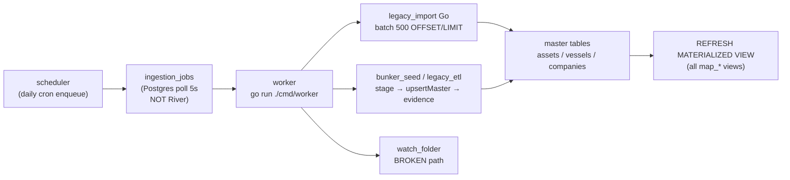

# MadSan V2 — Roadmap Status (2026-06-09, tip `9bbce7c`)

North star: **discover → verify → price → execute** (honest tiers, evidence chains, map-first UX).

## On-track assessment

| Pillar | Target | Status | Evidence |
|--------|--------|--------|----------|
| Discover | Global search, map layers, suppliers | **On track** | ⌘K search, energy/metals MVT, live AIS overlay, 76k assets |
| Verify | Dossiers, deals, sanctions, packs | **On track** | Entity dossier + evidence, DD rules, OpenSanctions, pack v1.1 + relationship graph |
| Price | Signals, opportunity score, freshness | **Partial** | EIA daily crude spot when keyed; VLSFO/Gold stub |
| Execute | Portal, billing, compliance gates | **Not started** | Supplier portal scaffold only; no billing/KYC cutover |

**Verdict:** MVP intelligence loop (discover → verify) is **shippable for internal DD**. Price feeds and execute path remain Phase 10+.

## Live data (madsan_db :5433)

| Table | Rows | Notes |
|-------|------|-------|
| companies | ~18.7k | Includes operator stubs from OSM backfill |
| assets | ~76k | Energy OSM + license cadastre |
| vessels | ~9.6k | Live AIS sync from legacy |
| evidence | ~227k | Provenance claims |
| relationships | ~16k | Company↔asset + vessel↔terminal |
| core_signals | ~18k | AIS + import snapshots |

## Phase completion

### Done (greenfield `madsan/`)

- Schema + migrations, Go API :8088, JWT auth, entitlements scaffold
- Ingestion: bunker seed, watch folder, Postgres job queue, worker/scheduler
- Legacy bridge: Go-native import (default), Python fallback
- Map: MapLibre terminal, vector tiles, WS live vessels, corridor lines
- Dossiers: company/asset/vessel, signals, signal history, relationships
- Deals: verify, sanctions, pack export (json/md/html), relationship graph in pack
- Admin console, metals vertical, global search
- **Git:** `madsan/` committed on branch `new-refactor-eng-style` (~159 tracked files)
- **Admin health:** `/admin` runtime panel + `GET /api/admin/health/runtime` (AIS sync, legacy parity drift)
- **Metals fix:** petroleum OSM rows excluded from metals tiles/search/summary; vertical switch resets layers
- **EIA ticker:** WTI/Brent daily spot via EIA v2 when `EIA_API_KEY` set; honest stub tier otherwise
- **Splink prep:** SQL duplicate clusters → pairwise CSV export (`/api/admin/dedup/companies/pairs.csv`, CLI)
- **Pairwise dedup scoring:** `pair_score.go` — trigram + country agreement; tiers `high_confidence` / `manual_review` / `skip`; cluster list + CSV export include `match_score` + `review_tier` (`e934964`)
- **Cross-name dedup discovery:** `cross_name_pairs.go` + migration `013_companies_trgm_index` — pg_trgm similarity pairs across differing `normalized_name`
- **Deals RBAC:** `/api/deals/verify`, `/{id}/pack`, `/{id}/watch` require JWT + entitlements (`deal_verification`, `deal_pack_export`); deals UI gates on `/api/core/auth/me`
- **RLS scaffold (dev):** migration `014_rls_scaffold` applied on dev — `usage_events` RLS + `madsan_rls` deny stub; `app_current_tenant_id()` helper; API still connects as owner (no behavior change until role cutover)
- **Legacy import (Go default):** `legacy_import` jobs via `processLegacyImportGo`; daily scheduler enqueue; Python opt-in only (`MADSAN_LEGACY_PYTHON`)
- **Parity gate:** `cmd/legacy-parity` CLI (exit 0/1) + cached admin Runtime health panel; 5% threshold on critical tables (`oil_vessels`, `licenses`, `petroleum_osm_features`). **Licenses green** — dedup-key parity (45,506 expected keys, 0.01% drift; `bcb0f2a`, `1f745a6`). **Petroleum OSM fail** (~70.6% under-imported, 89.5k/303.7k as of 19:44Z) — **Go `legacy_import` job running** (~37 min elapsed); blocks Python retirement until exit 0

### Partial

| Item | Gap | Next step |
|------|-----|-----------|
| 16-step ingestion pipeline | Jobs poll `ingestion_jobs`; no Splink/River | Human merge queue from scored pairs; Splink batch automation deferred |
| Python ETL | Fallback only | Licenses + vessels green; **petroleum_osm_features import** → retire `legacy_import.py` |
| Matviews | `map_energy_assets` may lag live tiles | Drop or refresh-on-ingest only |
| RBAC | Cookie auth MVP | Admin ✅ · Deals ✅ · portal/billing routes next |
| Price ticker | EIA crude when keyed | VLSFO/Gold stub; ICE/exchange feed deferred |
| Compose cutover | Prod overlay ready | Seed named volumes + Caddy deploy on ARM VM |
| Production launch | Checklist not run | Phase 14 — observability, backup cron, TLS |

### Not started (original plan)

- River job queue
- Splink entity resolution (automated merge from scored pairs)
- MCR v2, Comtrade ingest
- Billing, full observability stack
- Full supplier portal workflow

## Execution plan sync

Aligned with `madsan_v2_execution_log.md` and `madsan_v2_compose_rebuild_plan.md`:

| Phase | Item | Status |
|-------|------|--------|
| **3** | Scheduler + worker + job queue | **Done** |
| 10b | Dev compose (`compose_up.sh`) | Done |
| 10e | EIA open-data ticker | Done |
| 4d | Splink prep export | Done |
| **4d+** | Pairwise dedup scoring (clusters + CSV) | **Done** (`e934964`) |
| 11a | Admin runtime health | Done |
| **4e** | Legacy parity gate (CLI + admin panel) | **Partial** — licenses + vessels pass; petroleum OSM import pending |
| **RBAC** | Deals route auth + entitlements | **Done** (`e934964`) |
| **12d** | RLS scaffold (`014_rls_scaffold`) | **Partial** — applied on dev; API role cutover deferred |
| **13** | Prod compose overlay (`docker-compose.prod.yml`) | **Done** — limits, reservations, healthchecks, `linux/arm64`, named volumes, Caddy :80, no dev bind mounts |
| **14** | Production launch checklist | **In progress** (observability, TLS, volume seed, backup) |

## Architecture alignment

| Mandate | Compliance |
|---------|------------|
| Go permanent backend | New APIs/workers in Go ✅ |
| Legacy Python transitional | AIS via Go; legacy read Go-default ✅ |
| Honest coverage disclaimers | Gulf AIS, inferred vessel-terminal links ✅ |
| Postgres + PostGIS source of truth | All intelligence in madsan_db ✅ |
| Map not tables-only | Tiles + dossier + corridors ✅ |

## Next priorities (ordered)

1. **4e** — Full Go **Legacy import (all)** for `petroleum_osm_features` (no `max_rows` cap); re-run `legacy-parity` until exit 0 — **blocker for Python retirement**
2. **14** — Production launch checklist (TLS on Caddy, volume seed for `/raw`/`/etl`, `backup_db.sh` cron, smoke test via Caddy :80)
3. **12d** — RLS role cutover (`madsan_rls` + `SET app.tenant_id`) after map/search tenant audit
4. **Dedup merge** — Route `high_confidence` pairs into review queue; human merge workflow

## Risks

- **API OOM (exit 137):** prod overlay caps API at 1536m; monitor AIS batch size via admin health
- **Duplicate companies:** 18.7k rows with ETL duplicates; search deduped, DB not merged until review queue actions
- **Inferred links:** vessel-terminal and operator links are intelligence hints, not facts
- **OpenSanctions:** screening is review-tier, not confirmation
- **Prod volumes:** `madsan_raw_data` / `madsan_etl_data` named volumes start empty — seed before legacy import jobs
- **Parity drift:** licenses + vessels pass; **petroleum_osm_features ~70% under-imported** blocks Python retirement — full Go Legacy import (all) must finish with worker up
- **Watch folder:** 2 failed jobs — bad `RawDataDir` when worker runs from `madsan/backend` (`…/backend/madsan/raw` missing); fix path or run worker from repo root / compose

## Known gaps (2026-06-09 audit vs plan)

Cross-check: plan `madsan_intelligence_v2_92fbee25`, `legacy-parity` CLI, `ingestion_jobs` table, git tip `9bbce7c`.

### Ingestion pipeline — plan vs shipped

**Plan (Phase 2–3):** `scheduler (cron) → ingestion_jobs (River) → worker 16-step pipeline` with hash-skip, raw snapshots, staging → normalize → dedup thresholds → evidence → targeted matview refresh.

**Shipped:**



| Plan step | Status | Notes |
|-----------|--------|-------|
| River queue | **GAP** | Postgres `FOR UPDATE SKIP LOCKED` poll only |
| 16-step worker flow | **GAP** | ~8 steps: no API ETag, no per-row checksum skip, no Splink dedup tiers in pipeline |
| Hash / skip unchanged | **PARTIAL** | SHA256 in `watch_folder` only; legacy Go import always re-reads |
| Raw snapshot on disk | **PARTIAL** | `SnapshotRaw` exists; not wired for all adapters |
| manual_review_queue in pipeline | **PARTIAL** | Dedup admin enqueue only; not post-import uncertain routing |
| Targeted matview refresh | **GAP** | `refreshServing` refreshes all energy/metals/vessel matviews every job |
| Splink batch dedup | **GAP** | CSV export + Go `pair_score` only; no Splink runtime |
| watch_folder cron path | **BLOCKED** | Fails: `open …/backend/madsan/raw: no such file or directory` |

**Import job status (live):** 1× `legacy_import` **running** (started 19:07Z); 3× completed; petroleum count climbing (~89.5k → target 303.7k). Worker on host (`go run ./cmd/worker`); compose stack currently DB-only.

### Phase gap summary

| Phase | Status | Top gap |
|-------|--------|---------|
| 0 Reports + scaffold | **FIXED** | — |
| 1 Schema + matviews | **FIXED** | Serving matviews may lag during long imports |
| 2 Ingestion pipeline | **GAP** | Simplified path; no Splink / NormalizedRecord adapters for APIs |
| 3 Scheduler + worker | **IN_PROGRESS** | No River; watch_folder broken; not full 16-step |
| 4 Legacy ETL | **IN_PROGRESS** | Petroleum OSM ~70% under-imported (**BLOCKED** on import finish) |
| 5 Go core + auth | **IN_PROGRESS** | Entity response shape partial; httpOnly cookie MVP |
| 5b Entitlements | **FIXED** | Scaffold + deals gating shipped |
| 6 Map + MVT | **FIXED** | — |
| 6b Realtime WS | **IN_PROGRESS** | Hub exists; no binary frames / dead-reckoning / 202 job queue |
| 7 Energy UI | **IN_PROGRESS** | VLSFO ticker stub |
| 8 Supplier discovery | **IN_PROGRESS** | Ranked search partial |
| 8b–8f Intelligence | **GAP/PENDING** | MCR v2, pgRouting, Splink runtime not started |
| 9 Deal verification | **FIXED** | Pack v1.1 + RBAC |
| 9b Deal monitoring | **IN_PROGRESS** | Watch scaffold (`72d2691`); no alert engine |
| 10 Portal + admin | **IN_PROGRESS** | Admin ✅; supplier workflow incomplete |
| 11 Metals vertical | **IN_PROGRESS** | Petroleum excluded from metals tiles ✅; cadastre gaps |
| 12 Data gaps | **IN_PROGRESS** | Bunker prices, Gulf AIS labeling |
| 12c Legal | **IN_PROGRESS** | Page shipped; external sign-off **BLOCKED** |
| 12d Security/RLS | **IN_PROGRESS** | `014` scaffold + GUC stub; role cutover **BLOCKED** |
| 12e Notifications | **GAP** | Not started |
| 13 Perf + deploy | **IN_PROGRESS** | Prod overlay ✅; TLS/k6/observability **BLOCKED** |
| 14 Advanced intel | **PENDING** | Optional backlog |

## Runtime

**Dev (hybrid or full Docker):**

```bash
./madsan/scripts/compose_up.sh              # dev stack :8088 / :3001
./madsan/scripts/start_api.sh               # API only on host
cd madsan/frontend && npm run dev           # :3000
```

**Prod overlay (~23 GiB ARM VM):**

```bash
cp madsan/deploy/.env.example madsan/deploy/.env   # secrets + LEGACY_DATABASE_URL
docker compose -f madsan/deploy/docker-compose.yml \
  -f madsan/deploy/docker-compose.prod.yml \
  --profile proxy up -d --build
# Browser → http://<vm>:80  (Caddy); set NEXT_PUBLIC_API_URL to same origin
```

Seed named volumes once (if ingestion needs host files):

```bash
docker run --rm -v madsan_raw_data:/dest -v "$PWD/madsan/raw":/src:ro alpine cp -a /src/. /dest/
docker run --rm -v madsan_etl_data:/dest -v "$PWD/madsan/etl":/src:ro alpine cp -a /src/. /dest/
```

**Parity check (before Python retirement):**

```bash
cd madsan/backend && go run ./cmd/legacy-parity   # exit 0 = gate pass
```

DB (dev): `deploy-madsan-db-1` :5433 · Legacy: `mining-db` :5434
