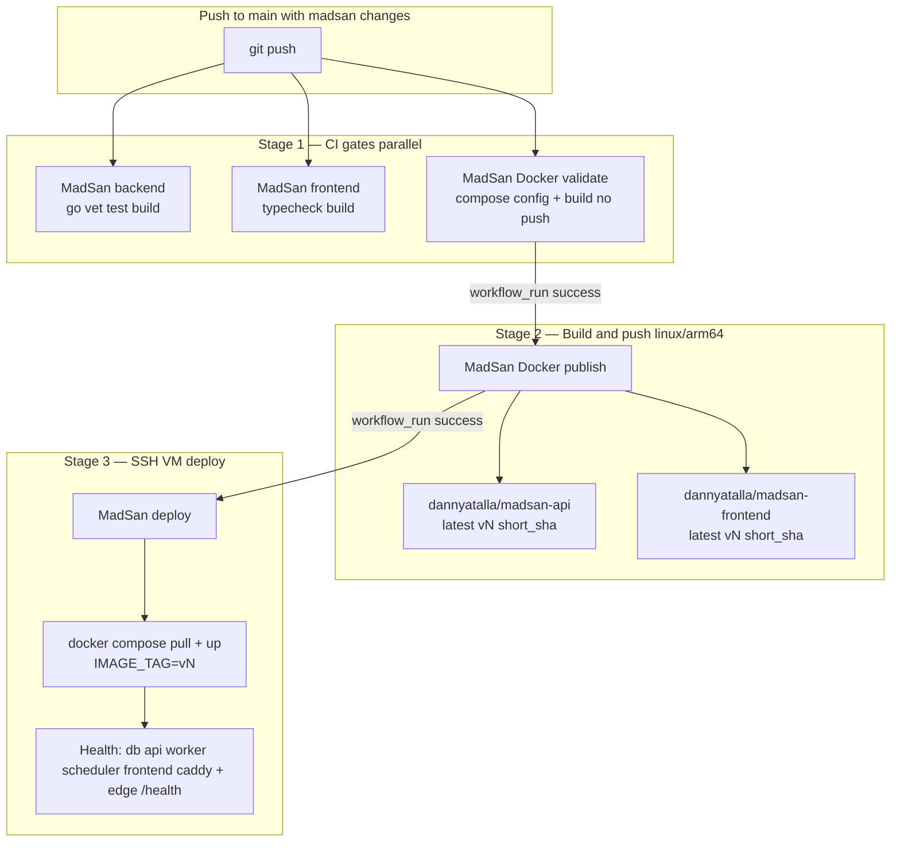

# MadSan production deploy

Standalone checkout path on the prod VM: **`/opt/madsan/`** (not `/opt/mining-map/madsan/`).

While MadSan still lives in the `mining-map` monorepo, clone the **full monorepo** to `/opt/madsan` and use compose paths under `madsan/deploy/`. After repo split, the same directory holds a MadSan-only checkout with `deploy/` at the repo root.

## Release pipeline (full chain)

Push to `main` / `master` / `paperclip2` with changes under `madsan/**` or `.github/workflows/madsan-*`:



| Stage | Workflow file | What it does |
|-------|---------------|--------------|
| 1a | `.github/workflows/madsan-backend.yml` | CI gate only — **no Docker image** |
| 1b | `.github/workflows/madsan-frontend.yml` | CI gate only — **no Docker image** |
| 1c | `.github/workflows/madsan-docker.yml` | Validate compose YAML; build API + frontend locally (`push: false`) |
| 2 | `.github/workflows/madsan-publish.yml` | Build + push to Docker Hub (`DOCKER_USERNAME` / `DOCKER_PASSWORD`) |
| 3 | `.github/workflows/madsan-deploy.yml` | SSH to VM (`REMOTE_*`); stop legacy stack; `compose pull` + `up`; health checks |

Manual runs: `workflow_dispatch` on **MadSan Docker publish** or **MadSan deploy** (choose ref and `IMAGE_TAG`).

### Images pushed vs compose services

| Registry image | Built from | Compose service(s) | Notes |
|----------------|------------|-------------------|--------|
| `dannyatalla/madsan-api` | `madsan/deploy/Dockerfile.api` | `madsan-api`, `madsan-worker`, `madsan-scheduler`, `madsan-ais-ingest` | One image; different `command` per service (`/app/api`, `/app/worker`, `/app/scheduler`, `/app/ais-ingest`) |
| `dannyatalla/madsan-frontend` | `madsan/deploy/Dockerfile.frontend` | `madsan-frontend` | `NEXT_PUBLIC_API_URL` baked at publish |
| `imresamu/postgis:16-3.6.1-bookworm` (prod arm64) | — (multi-arch) | `madsan-db` | Official `postgis/postgis` is amd64-only; prod overlay uses `imresamu/postgis` on arm64 VMs |
| `caddy:2-alpine` | — (official) | `caddy` | `--profile proxy`; not built in CI |

Prod overlay (`docker-compose.prod.yml`) sets `IMAGE_TAG` (default `latest`; auto deploy uses `v<publish-run-number>`).

Automated deploy: **`.github/workflows/madsan-deploy.yml`** (repo root).

## GitHub secrets (repository Settings → Secrets)

MadSan deploy uses these **SSH and registry secrets** (repository Settings → Secrets):

| Secret | Purpose |
|--------|---------|
| `DOCKER_USERNAME` | Docker Hub login for `madsan-publish.yml` |
| `DOCKER_PASSWORD` | Docker Hub token/password for publish |
| `REMOTE_HOST` | VM hostname or IP |
| `REMOTE_USER` | SSH user (e.g. `ubuntu`; must run `docker compose` or have passwordless sudo for legacy shutdown) |
| `REMOTE_SSH_KEY` | Private key for SSH (PEM; no passphrase recommended for Actions) |

Optional aliases (only if `REMOTE_*` is not set): `MADSAN_DEPLOY_HOST`, `MADSAN_DEPLOY_USER`, `MADSAN_DEPLOY_SSH_KEY`.

**Do not** add MadSan-specific GitHub secrets for API keys (`AISSTREAM_API_KEY`, `GROQ_API_KEY`, `EIA_API_KEY`, etc.). Those belong in **`madsan/deploy/.env` on the VM only** — the deploy workflow never reads them from GitHub.

Optional repo **variable** (not secret): `MADSAN_NEXT_PUBLIC_API_URL` — baked into the frontend image at publish time; should match `NEXT_PUBLIC_API_URL` in `deploy/.env` on the VM.

Optional: create a GitHub **environment** named `production` if you want approval gates on publish/deploy jobs.

## VM env file (`deploy/.env`)

Copy from `deploy/.env.example` on the host. Never commit real values.

**Required for production**

| Variable | Notes |
|----------|--------|
| `MADSAN_DB_PASSWORD` | Postgres password for `madsan-db` |
| `MADSAN_JWT_SECRET` | Strong random secret for auth |
| `NEXT_PUBLIC_API_URL` | Browser → API URL (e.g. `http://your-host` or `https://…` behind TLS) |

**Recommended**

| Variable | Notes |
|----------|--------|
| `LEGACY_DATABASE_URL` | Host-side legacy mining-db if used |
| `MADSAN_DOCKER_LEGACY_DATABASE_URL` | In-container legacy DB URL override |
| `AISSTREAM_API_KEY` | Enables `--profile ais` on deploy when set |
| `EIA_API_KEY` | Daily crude ticker |
| `GROQ_API_KEY` / `OPENROUTER_API_KEY` | AI DD copilot |
| `OPENSANCTIONS_API_KEY` | Sanctions screening |
| `SHIPVAULT_*` | Vessel registry enrichment (see `.env.example`) |

**Production overlay tuning** (optional, in `deploy/.env`)

`MADSAN_DB_MEM_LIMIT`, `MADSAN_API_MEM_LIMIT`, `MADSAN_CADDY_HTTP`, `MADSAN_RUN_MIGRATIONS` (default `true` — API runs migrations on startup).

## First-time VM bootstrap

Target: **linux/arm64** VM (~23 GiB RAM per prod overlay comments).

**Automated (recommended):** run **MadSan deploy** (`workflow_dispatch` on `madsan-deploy.yml`) after setting GitHub secrets (`REMOTE_HOST`, `REMOTE_USER`, `REMOTE_SSH_KEY`). The deploy script auto-bootstraps when `/opt/madsan` is missing or not a git checkout:

1. `mkdir -p /opt/madsan` (with `sudo` + `chown` if needed)
2. If `/opt/mining-map` is already a git checkout and `/opt/madsan` is empty, symlink `/opt/madsan` → `/opt/mining-map`
3. Otherwise `git clone` the monorepo via `GITHUB_TOKEN` (workflow `contents: read`; no deploy key required for Actions-driven clone)
4. `git fetch` + `git checkout origin/main` (compose/deploy files; app images come from registry `IMAGE_TAG`)
5. Copy `madsan/deploy/.env.example` → `madsan/deploy/.env` **only when `.env` is missing** (never overwrites an existing file)
6. Run `madsan/scripts/seed_prod_volumes.sh` only when `madsan_raw_data` / `madsan_etl_data` volumes are empty
7. Stop legacy stack at `/opt/mining-map`, then `docker compose pull` / `up`

Prerequisites on the VM: Docker Engine + Compose v2, `git`, `curl`; deploy user in `docker` group (or passwordless `sudo` for legacy shutdown). `jq` is optional — health poll falls back to `sed` when absent.

**One-time VM permission note:** the deploy user needs **passwordless `sudo` for `mkdir` and `chown` under `/opt`** (bootstrap only), **or** an operator must pre-create the checkout directory before the first deploy:

```bash
sudo mkdir -p /opt/madsan
sudo chown ubuntu:ubuntu /opt/madsan   # match REMOTE_USER
```

If `sudo` is unavailable during bootstrap, the deploy script falls back to cloning into `$HOME/madsan` and symlinking `/opt/madsan` when possible; otherwise it uses `$HOME/madsan` for that run.

**Manual bootstrap** (optional — same end state):

```bash
# 1. Docker Engine + Compose v2 plugin
sudo apt-get update && sudo apt-get install -y docker.io docker-compose-v2 git curl
sudo usermod -aG docker "$USER"
# Re-login so docker group applies

# 2. Checkout (monorepo interim — full mining-map repo at /opt/madsan)
sudo mkdir -p /opt/madsan
sudo chown "$USER":"$USER" /opt/madsan
git clone git@github.com:daniataal/mining-map.git /opt/madsan   # SSH deploy key, or HTTPS with PAT
cd /opt/madsan

# 3. Host env (paths differ pre/post split — see monorepo note below)
cp madsan/deploy/.env.example madsan/deploy/.env   # monorepo
# OR after split: cp deploy/.env.example deploy/.env
# Edit secrets on the host only.

# 4. Seed named volumes once (raw + etl for worker/scheduler)
./madsan/scripts/seed_prod_volumes.sh            # monorepo
# OR after split: ./scripts/seed_prod_volumes.sh

# 5. First stack bring-up
docker compose -f madsan/deploy/docker-compose.yml \
  -f madsan/deploy/docker-compose.prod.yml \
  --profile proxy up -d --build
# Add --profile ais when AISSTREAM_API_KEY is set in deploy/.env
```

**Private repo clone auth:** GitHub Actions passes `GITHUB_TOKEN` for the one-time clone during deploy. For manual `git pull` on the VM afterward, configure either an SSH deploy key (`git@github.com:…`) or a read-only PAT in `git credential` — do not store tokens in `.env`.

Verify:

```bash
curl -fsS http://127.0.0.1/health
MADSAN_API_URL=http://127.0.0.1 k6 run madsan/deploy/k6-smoke.js   # monorepo path
```

Install backup cron (optional): `madsan/scripts/install_backup_cron.sh`

## Automated deploy behavior

| Trigger | What happens |
|---------|----------------|
| Push to `main` / `master` / `paperclip2` with `madsan/**` changes | **Stage 1:** backend + frontend + Docker validate (parallel) → **Stage 2:** publish to Docker Hub → **Stage 3:** SSH deploy (pull + up + health) |
| Push without `madsan/**` changes | No publish or deploy |
| Pull request | Never publishes or deploys |
| `workflow_dispatch` on publish / deploy | Manual registry push or VM deploy with chosen ref and `IMAGE_TAG` |

Deploy steps on the VM:

1. **Stop legacy mining-map stack** at `/opt/mining-map` (`docker compose -f docker-compose.prod.yml down --remove-orphans`; volumes preserved). Tries deploy user, then `sudo docker compose`, then `sudo docker-compose`. **Non-fatal** — warns and continues if shutdown fails (permissions, stack not running, or compose missing).
2. `git fetch` + `git checkout origin/main` (compose/deploy scripts; not the publish SHA)
3. `export IMAGE_TAG=v<publish-run>` (or `latest` / short SHA via manual dispatch)
4. `docker compose … pull` for `madsan-api`, `madsan-worker`, `madsan-scheduler`, `madsan-frontend` (and `madsan-ais-ingest` when `AISSTREAM_API_KEY` is set). Worker/scheduler/ais share the **same** `dannyatalla/madsan-api` image tag.
5. On pull failure, fallback: `docker compose … build --pull`
6. `docker compose … up -d --remove-orphans --wait` with profiles `proxy` and optionally `ais`
7. Health poll: `madsan-db`, `madsan-api`, `madsan-worker`, `madsan-scheduler`, `madsan-frontend`, `caddy` (+ `madsan-ais-ingest` when enabled)
8. Edge check: `curl http://127.0.0.1/health` (Caddy → API)
9. Migrations run via API (`MADSAN_RUN_MIGRATIONS=true` in compose)
10. Scoped image cleanup (see below)

**First run:** if `/opt/madsan` is missing or not a git checkout, deploy auto-bootstraps (clone or legacy symlink), creates `.env` from `.env.example` when absent, and seeds empty prod volumes. Existing `madsan/deploy/.env` on the VM is never overwritten.

## Image cleanup strategy

After a successful health check, the deploy script:

1. `docker image prune -f` — dangling layers only (safe on a shared VM)
2. Removes **unused** images labeled `com.docker.compose.project=madsan` (not referenced by any container)
3. `docker builder prune -f --filter until=48h` — old build cache

It does **not** run `docker image prune -a` and does **not** remove legacy mining images — only stops legacy **containers** before bring-up.

Set `COMPOSE_PROJECT_NAME=madsan` so labels stay consistent.

## Cutover from legacy mining-viz

| Legacy mining-viz | MadSan |
|-------------------|--------|
| Path `/opt/mining-map` | Path `/opt/madsan` |
| Manual VM deploy / legacy CI (removed) | Workflow `madsan-deploy.yml` (auto after CI on `main`/`paperclip2`, or `workflow_dispatch`) |
| Registry images `dannyatalla/mining-*` | Registry images `dannyatalla/madsan-api`, `dannyatalla/madsan-frontend` (pull on VM; fallback build) |
| GitHub injects API keys at deploy | API keys in `madsan/deploy/.env` only |

## Troubleshooting

| Symptom | Likely cause | What to do |
|---------|--------------|------------|
| `docker ps` empty on the VM | Deploy never finished (failed at prepare env, checkout, pull, or health) | Check **MadSan deploy** workflow logs on GitHub Actions; re-run **MadSan deploy** with `workflow_dispatch`, ref **`main`**, and the intended `IMAGE_TAG` (e.g. `latest` or `v<N>` from publish) |
| Deploy fails at **prepare deploy env** | Missing or unreadable `madsan/deploy/.env`, or stale deploy script from an old git checkout | Confirm `/opt/madsan/madsan/deploy/.env` exists and is readable; fill in real secrets (not `.env.example` placeholders). Ensure VM checkout is on `origin/main` so compose scripts match current main |
| `.env` exists but stack still unhealthy | Placeholder values from `.env.example` (`MADSAN_DB_PASSWORD`, `MADSAN_JWT_SECRET`, etc.) | Edit `.env` on the host with production secrets; redeploy |
| `compose up` fails: postgis `does not provide the specified platform (linux/arm64)` | Official `postgis/postgis:16-3.4` is amd64-only on an aarch64 VM | Ensure `docker-compose.prod.yml` on VM sets `MADSAN_DB_IMAGE=imresamu/postgis:16-3.6.1-bookworm` (default in prod overlay); `git pull` / redeploy from `main` |

Auto-deploy after publish pins **registry** tags (`IMAGE_TAG=v<N>`) but checks out **`origin/main`** for compose files — not the publish commit SHA. If a deploy ran before a workflow fix landed, re-run deploy manually with ref **`main`**.

## Routine deploy (manual)

```bash
cd /opt/madsan
git fetch origin
git checkout <tag-or-sha>
docker compose -f madsan/deploy/docker-compose.yml \
  -f madsan/deploy/docker-compose.prod.yml \
  --profile proxy --profile ais up -d --build
```

## Backups

Manual backup:

```bash
cd /opt/madsan && ./madsan/scripts/backup_db.sh
ls -lh backups/madsan_v2_pre_*.dump
```

Object-storage automated backup is **not** implemented yet.

Restore drill (non-prod DB): `madsan/scripts/restore_madsan_db.sh`, `agent_reports/madsan_v2_launch_checklist.md`.

## Rollback

See [rollback.md](./rollback.md). Never run `docker compose down -v` on prod.

Quick rollback:

```bash
cd /opt/madsan
git checkout <previous-good-sha>
docker compose -f madsan/deploy/docker-compose.yml \
  -f madsan/deploy/docker-compose.prod.yml \
  --profile proxy up -d --build
```

Restore DB from `backups/` only if schema/data regression requires it.

## Monorepo note (pre-split)

| Item | Monorepo (`/opt/madsan` = full repo) | Standalone (post-split) |
|------|--------------------------------------|-------------------------|
| Compose | `madsan/deploy/docker-compose.yml` | `deploy/docker-compose.yml` |
| Env | `madsan/deploy/.env` | `deploy/.env` |
| Scripts | `madsan/scripts/…` | `scripts/…` |

The deploy workflow auto-detects which layout is present on the VM.
